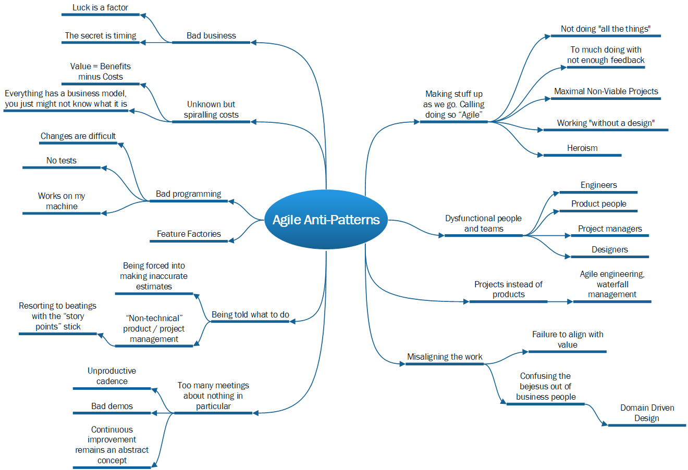

# Agile\* Anti-Patterns

\* I'll probably moan about things that aren't strictly Capital-A-Agile too,  but it's mostly that.

This is the Mind Map of the "Agile anti-patterns" article.

## TLDR of the whole series

This is part two of a set of three essays where I jump on the "Agile Is Dead, Long Live Agility" bandwagon:

1. [The first essay](./Agile_WhatsThePoint.md) suggests that we've forgotten that agility was originally a defence against the chaos of working in a frictionless Digital Realm of infinite possibilities (i.e.: "the Quantum Realm but with more meetings"). It also upbraids some of the computer programming fraternity (the "we hate meetings" ones, mostly) for asking to be "left alone to get on with it", while handing off the the responsibility for defining "the value of the work" to everyone else.
2. This one is going to get really snarky as I go into detail about things that are wrong with Capital-A-Agile. It's the fun essay, in other words.
3. [The third essay](./Agile_Value.md) dives into the concept of value, reviews some of the approaches that attempt to square the circle of small-a-agility by defining value properly, and gets just a tiny bit political.

If you're a bit confused by the Capital-A-Agile / small-a-agility distinction then it's covered [in the first one](./Agile_WhatsThePoint.md), where I also explain that I've [stolen it from Dave Thomas](https://youtu.be/a-BOSpxYJ9M?si=m5g_B7sa9_wK06cp).

## TLDR of this article

Working in a frictionless universe of infinite possibilities means we can, and often do, just **make stuff up we go along**, while kidding ourselves that we're making progress towards some goal or other. Quite often we call doing this "being Agile", when it's often just pure chaos and time-wasting.

We often like to justify our professional salaries while we're making stuff up, too, by card-carrying our expertise around (in the case of disfunctional programmers and designers), or waving Capital-A-Agile Scrum-Master / Product Owner certificates in people's faces and using big words from business school (in the case of disfunctional Business / Product people).

None of this provides any lower-case-a-agility, because it's highly unlikely to deliver any value, unless we get at-best-once-in-a-career lucky.

If you'd like to skip to some ways of using the frictionlessness of the Digital Realm to actually play the percentages of success better\*, check out [the next essay](./Agile_Value.md). But you'll miss a lot of snarky fun if you do.

\* Well, at least *in theory*, but some of the solutions have their own issues too.

## Making stuff up as we go and calling it "Agile"

This is the predominant approach everywhere I've worked. Because there's no friction in the Digital Realm, the knee-jerk reaction is always to take the path of least resistance. One manifestation of this is for someone senior to say "yes" whenever presented with a bright idea / terrible problem, then drive-by some underling's desk and ruin their day with it. One way to measure how deeply into this culture you are is the length of the "equal first priority list" - wherever you are, there's usually at least a couple of GREAT-BIG-IMPORTANT-THINGS lurking about with the potential to distract you, but I've worked in places where the list has been in double figures, and: "...what will I be working on today?" has been a constant source of mystery.

Most of the books on Agile (and small-a-agility, too, for that matter) seem to suggest the existence of organisations where these sorts of thing *never* happen. If so I imagine their corporate HQs are nestled in the foothills of the Big Rock Candy Mountain.

### Not doing all the things

If you've read about the Twelve Angry Snakes in [article one](./Agile_WhatsThePoint.md) then you already know my views on this. Cherry picking "the bits of Agile that suit us" is a terrible thing to do because each bit of the puzzle is a check and balance on at least one of the other bits. Pull any piece out and they all collapse around you.

If you ever work somewhere that says its being ["Wagile"](https://cloudcoach.com/blog/what-is-wagile-project-management/) then you might want to reflect upon your life choices. That said - a lot of places do "Agile engineering with Waterfall strategy and tactics", which is a great way of wasting time and money, and only delivering good things by accident. Lots more about that below with [some antidotes in article three](./Agile_Value.md).

### Too much 'doing', not enough feedback

When you end up planning, 'refining' and building 'stuff' without regular feedback from customers (both users and buyers), then its a sure sign you're in a Capital-A-Agile world and not a small-a-agility one. Users and buyers are the only people who can confirm the value of what you're doing, usually by voting with their feet, but not actually *telling you* why.

The only legitimate confirmation is in their *actions*, not what they actually say. Often they'll know just how much effort has been put into what you're showing them, and they'll hide their misgivings just to spare your feelings.

So take the smallest possible step each time, then deploy the change somewhere you can get meaningful, measurable feedback. Chuffing your work out into some sort of demo that customers / stakeholders are forced to attend at knifepoint doesn't count. (See 'unproductive cadence' below).

### Maximal Non-Viable Projects

The concept of the "Minimal Viable Product" is a strong contender for "most-misunderstood in the whole of software engineering"(and it's a *very* big field). It's hard to know where to start with it, really - so there'll be a lot more about it in [article three](./Agile_Value.md), not least because it's the right idea at heart. But it's expressed very confusingly.

The "viable" part *really* confuses software engineers, because in their eyes "viable" often means "fully-scalable, completely secure, 99-point-five-nines test coverage, fully-normalised relational data model, and with a disaster-proof build pipeline". Or in other words - "please wait for at least six-months'-worth of effort for a team of ten before we can test your vague business idea".

That's obviously **not** what's meant by "minimal": at which point no finer example of the contradictory nature of small-a-agility exists. The otherwise really good book [Edge](https://www.thoughtworks.com/en-gb/insights/books/edge) by (original Manifesto signatory) Jim Highsmith, Linda Luu and David Robinson, gets itself in a right pickle with this concept, too - suggesting (like most software engineers) that "releasing an MVP" is something of a big milestone in the life of a Product, that occurs sometime towards the end of a huge amount of work, around the time you're ready to formally go-to-market. The good news is that Edge also describes about a thousand ways to test the viability of your product ideas (and, presumably, can the 9 ones out of ten that *aren't* viable) *before* you get to MVP. Note to Highsmith et al - that's what an MVP *is actually supposed to be*. That's what the "M" stands for.

I wish I could find the place I saw MVPs described as "Unit Tests for Value" - because that's a much healthier description, particularly if you're trying to clarify the concept with Software Engineers. If they're any good then they'll get that "Unit Test" means "the minimum amount of work to discover whether or not something works". (Hey kids, write that failing test first, then get it to pass).

Much more about this in [article 3](./Agile_Value.md).

### Working "without a design"

Confusing "Agile" vs "agility" alert. One of the 12 principles says:

* Continuous attention to technical excellence and *good design* enhances agility.

...but design is still-too-often thought of as "the thing you do at the start". This means the "continuous" part of the statement gets interpreted by programmers as "it's OK to dive right into things and see where I end up", because that's what a lot them would rather do - write code in a quiet corner somewhere and solve abstract problems that are only spuriously connected to reality. Finding out what the problem really is can be *hard* and involves actually interacting with people who probably won't react positively to your first few "bright" ideas.

Taking the bits from [Uncle Bob Martin](https://learning.oreilly.com/library/view/clean-code-a/9780136083238/) about writing code iteratively, and arbitrarily quoting them out of context, can be used to justify this behaviour. This behaviour usually settles into a pattern of...:

* Doing the "red" part of "red / green / refactor".
* Sprinkling in a big of "green" just to keep your manager off your back.
* Ignoring the "refactor" part completely because hey it's the hard bit and you never worked out how to do it properly.

However - just launching into the solution without putting some concious effort into some sort of design, without applying a few decent design principles to the problem, is almost certainly going to end up in mess. Eric Evans in his [Blue Book](https://learning.oreilly.com/library/view/domain-driven-design-tackling/0321125215/) even recommends brainstorming design ideas for your solution until there's nothing left but stupid suggestions, though Mr Evans generally doesn't seem to worry about delay that much.

Hey - whether you do it conciously or not, there *will be a design*, but if you haven't worked on it explicitly, it'll be a bad one. The only person who will understand and be able to change it will be you, most likely by breaking other bits of it when you do. And you'll then have to wait for customers to tell you what you broke, as well. Which brings us to...:

### Heroism

Do you know anyone who:

* Dives straight into code-only solutions?
* Bases these solutions on a few half-muttered sentences from one customer that started: "We want a..."?
* Ties themselves up in knots, but keeps going anyway because they don't want to admit they were wrong and throw their valueless work away?

You've got a hero programmer on your hands. I.e. someone who makes a load of trouble for themselves (and everyone else), but then swoops in to "rescue" the situation, often at 2am in response to some crisis or other. The propensity to rise up on command whatever the hour to stamp out fires means that the CEO loves this dude (it's nearly always a dude). They know how to fix *everything* (because they broke it all in the first place). They know where all the bodies are buried (because they did all the bad murders in the first place).

There's another form of the species - heroic designers. These are people who dive straight into user journeys, colour theory, mood-boards, grids, typeface choices etc - also without *really* finding out what the problems they're solving are - because (just like coding) "design is special and you need to be talented to do it" . In design terms, they [live entirely in the second diamond](https://www.designcouncil.org.uk/our-resources/the-double-diamond/).

I'm **not** saying that complex, technical endeavours don't benefit from knowledge and talent. I **am** saying that all the talent in the world won't help if you don't attempt to understand the problems you're trying to solve. Indeed - amazing skill and talent makes things worse if you deploy it too early as it:

* Takes you off in the wrong direction, *away* from the better solutions. At which point it's *worse* than being totally useless.
* Often makes people less objective about the facts of the case, particularly ones that contradict any hard-earned beliefs built up over glittering careers. All situations are different - what you know already probably doesn't apply this time.

Heroic behaviour can be summed-up as: "not listening to the people with the problem because I already know the answer", which extends to "bending the problem towards my solution because I've already built loads of stuff that doesn't help and I don't want to undo it". This still happens too much in software production, and it's a key reason nobody uses a lot of the stuff we produce.

I expect that it's lovely to be talented, and talented people are certainly great to work with. But it's so much better if they're also humble about it and know how to deploy their talent properly by approaching each problem on its own merits.

## Dysfunctional people and teams

Full disclosure - I am of course at least as guilty of committing the crimes listed below as anyone else. It's almost as if the frictionless-ness of the infinite Digital Realm makes it easy to act in the following shameful ways.

### Engineers

* Who exist to solve abstract problems without thinking about concrete ones.
* Who argue about "patterns" / talk endlessly about obscurities like "aggregate roots" or "hexagonal architectures"\*, again without listening to the problem.
* With Marlene Dietrich syndrome: *"I want to be alone"*.
* Who invent "requirements" and implement solutions without checking their value.
* Who act heroically (see above).
* Who simply don't know how to build code-bases that are easy to change in future (I've lost count of the numbers of highly-paid engineers I've worked with who *don't know what interfaces are for*).

\* There's nothing wrong per-se about either of these concepts but there's a time and a place, you know?

Such ne'er-do-wells will most likely march you away from anything good, at a rapid pace that's easy to confuse with "progress". Knowledge about the things you would have been better off doing in the first place will emerge eventually though, at which point they won't want to re-do all the stuff they've built so far. So they'll try and bend / break what they've done up to that point to better fit reality. This [causes more Technical Debt](https://youtu.be/d2Ddo8OV7ig?si=mp9oGFX-sCv4nwQ6) than any other factor.

### Designers

* Who also invent requirements.
* And who also act heroically.
* Who obsess over little details - e.g. moving things six pixels to the left - when they're yet to find out which market segment the product is being aimed at and what sort of customer relationships we're trying to build.
* Who often don't even exist in the first place? Designers tend to be heavily outnumbered by engineers for some reason, when both jobs take a similar amount of effort to do properly... I've never understood why this is.

Actually, while I'm ranting - modern JavaScript is what happens when Graphic Designers kidnap a programming language. It was actually the first language I ever learned, but these days using it to learn programming would be like learning about human anatomy by staring at a Picasso. If you ever see any code that ends in a brutal diagonal line of 25 closing braces, I advocate running screaming from the building. It's become this twisted, weird, semi-functional thing, so much so that people are having to resort to TypeScript to make any sense of it. (Hey, why "transpile" something once when you can do it twice?)

Also, a rabbit hole of design systems / "languages" seems to have opened up, so now designers take massive steps *away* from problems into an abstract world of components and widgets, that are intended to be all things to all UIs. They're kind of like nuclear physicists trying to come up with a Unified Theory of Everything, only *slower*. I was once told that I'd have to wait *three months* before the code to *render a table* was ready. A **table**; something that was in  HTML v0.0.1. I thought someone had spiked my drink.

I guess it's the same as computer programmers that don't really understand patterns but try and apply them everywhere regardless - we're diving into abstractions without bothering to understand the problems. It always comes back to that.

### Product people

* Who "speak for the customer" without ever going to see what customers actually do.
* ... and *should* they ever go and see a customer, go by themselves, and then return with a gift-wrapped "solution" for designers and engineers to "just build".
* Who ask the customer "what they want" and take orders like waiters. This is where the [mis-attributed Henry Ford quote](https://medium.com/@adrianh/faster-horses-50ff8bb1bb62) about Faster Horses gets rolled out. Ask [the right question](./Agile_Value.md)!
* Who lack technical confidence, and so further seek to justify their existences by placing themselves between the customers and people who can solve their problems. Bring the technical / clever people to problem first, then at least have a vague idea what the solutions they're proposing are.
* Who cling faithfully to **"their vision"**, ignoring the industry-wide odds that only one-in-three to one-in-ten "great" ideas actually make a positive difference.
* Who believe that it's possible to write a "detailed Road Map for the next 12 months". Sorry to burst your bubble but it's more than likely going to get blown out of the water by reality after about six weeks, max (though it can often only take days).

These herberts are the worst of the lot. (I have done all of these things and occasionally still do when I let my guard down).

More than anything else, it's the Product person's job to bring the problem solvers to the problem, and help them understand it. When they interject themselves *between* problem and solvers, they do more damage than everyone else put together.

### Project Managers

* Who even exist in the first place. Managing adventures in the Digital Realm like you would manage bridge or house-building in the Real World is a sign that you've [missed the point](./Agile_WhatsThePoint.md) at a very fundamental level.

... which brings me to:

## Projects not Products

Producing software with a *project* is a hold-over from the bridge-building days - it just doesn't work in the Digital Realm. Did I mention that [it's infinite](Agile_WhatsThePoint.md)? This obviously means that *you can go on forever*, which I certainly wouldn't advocate. What I would suggest, however, is *not stopping while there's still money on the table*. Getting product / market fit and some momentum towards enthusiastic users / customers is *hard* - if you do everything well, you're still only increasing the odds of success from 1 in 10 to 1 in 3.

So why would you get to that point and say: "well, we've delivered all the features we set out to, so let's disband the team?" The fact is that this probably wouldn't happen - very few business people are that stupid, even the ones that are *really uncomfortable* in the Digital Realm. Some more money to keep going would fall from the magic tree.

Oddly, though, you'll quite often be allowed to continue even if you've got *nowhere near* fulfilling the promise of whatever grand idea the big boss had three years ago that kicked-off whatever death march you're on. "Failed projects" seem to be a fact of life these days: people just soldier on regardless, even if under clouds of pessimism and intense grumpiness.

So why pretend projects make sense? It all comes down to a need to *feel* in command and control, despite the fact that all the up-front planning, business-case creation, budgeting etc tend to have completely the opposite effect. The plan goes off the rails pretty much from day one, it becomes obvious to the team that they're marching in the wrong direction, but that's the way the plan says we all have to go, the Project Manager is ticking off our "deliverables" and so on we all march (slowly) towards the delivery of nothing useful.

It's one of the weirdest, most counter-intuitive ironies of the Digital Realm that to gain control, you pretty much have to give it up. Who knew?

## Misaligning the work

One of the biggest barriers to productivity is when teams block each other, or even worse, work at cross purposes, both working on the same (usually ill-defined) problem in their own little silos, blissfully unaware what the others are up to. Mad though this sounds, it happens *all the time* in the Digital Realm, where (of course), you can't actually *see* what other people are up to without actively looking for it, because it doesn't exist in any real, physical sense.

The solution to this is to *isolate* teams by aligning them with problems that have well-defined boundaries between them. This is at the core of the "engineer-led" solution to the issue: Domain-Driven Design. DDD is a popular methodology with the architects amongst us, but one which I've not really seen applied successfully anywhere. What can I say? I've lead a sheltered life. But the idea goes like this: the work of the business should be broken down into "sub-domains" around concepts that apply to the overall enterprise, but that are significantly different from each other to enable isolated work.

These sub-domains are to be defined by the "ubiquitous languages" that people within those domains use, and engineers should learn to use *in their actual code* - i.e. naming classes, methods and variables using the language of the people you're solving the problems for. These sub-domains should also have "bounded contexts" around them which define their scope and establish how they relate to other sub-domains around them. Each sub-domain can then have teams assigned to work within it, safe in the knowledge that they'll be able to get on with plenty of work without either getting blocked by each other, or treading on each others' toes.

All this look marvellous *in theory*, but it practice slicing your business function up into sub-domains based on the language people use within those domains *is really bloody difficult*, and the methods anyone could feasibly use to do so are so soft, gooey and social-sciency that you'd need to have balls of steel to attempt them in any well-established business. I've been involved (even helped instigate) attempts at doing so before, and they all ended up being engineer and architect talking-shops. Note: you can't develop a "ubiquitous language" without involving *the people that speak that language in the first place*. And they're always kind of busy and won't turn up willingly unless it's completely obvious what they're getting out of it. "We're looking for a way of making our software engineering teams more autonomous" is *never* going to register as something of value to anyone other than Software Engineering management, and it's too easy for the engineers to take over the discussion and start trying to solve people's 'problems' without listening to what those actually are.

So, while lots of people have tried it and it's still got legs within the engineering fraternity, I'd love to see a proper piece of research into how effective DDD really is. I've found this [Literature Review](https://www.sciencedirect.com/science/article/pii/S0164121225002055) about it which is certainly rigorous and methodical, but feels like it's got a fundamental issue of bias behind it - i.e. hardly anyone within the software engineering business is going to waste time publishing papers about how badly wrong their initiative went.

There's a [good set of articles about it here](https://no-kill-switch.ghost.io/the-failed-promise-of-domain-driven-design-part-1/) by Sebastian Gebski. I landed on the third one, because he too has struggled to find decent evidence of it working, but it's worth reading all four. Incidentally its interesting how Sebastian and I seem to violently agree on the core issue of the Digital Realm while taking what looks like polar-opposite stances on it. He states that "reality is infinite" because there are an infinite number of ways to model it - whereas I'm going to stick to my guns here and say "the models aren't real", and those models are part of the Digital Realm. And there *aren't* an infinite number of ways to build a house, or a real world product. But as I say, I feel violent agreement lurking here - it's "infinity" that causes all the angst.

Sebastian proposes a good pair of concrete examples of DDD's failure to help with modelling around the ambiguities of reality in his [first article](https://no-kill-switch.ghost.io/the-failed-promise-of-domain-driven-design-part-1/). I'm going to quote them in full:

* Should "discounts" be a part of "item pricing"? Depend on it? Or the other way around? And the "basket discounts"? And the "volume discounts"? And ...
* What would be the best way to organise courier delivery? Around "courier availability", "routes", "scheduled deliveries", or "availability in the vicinity" (these are four different perspectives on the very same data)?

As I say, these are *superb* examples of the sort of logical danse-macabre it's *so* easy to get into when you're working in the Digital Realm. If you think you can rely on business people to give coherent answers to these sorts of questions then steel yourself for disappointment. The way I'd suggest coping with either of these questions would be to refer to the Customer Segment, Customer Relationship, Revenue Model and Channels sections of your Business Model Canvas and pick the options that most align with how you're planning to make money and do business with your customers. But that's a big spoiler for [article 3](./Agile_Value.md), where I'll come back to these specific examples.

## Too many meetings about nothing in particular

This seems to be the thing that's really got under the skin of the programming fraternity when the phrase "Agile is Dead!" is bandied about. I believe there to be two main culprits: value-free demos and toothless retrospectives. Both of these are caused by *having to stick to a cadence* regardless of all common sense.

### Unproductive cadence

A lot of capital-A-Agile teams insist upon "ceremonies\*" held at regular times throughout Sprint and release cycles. I too have been made to work in this way and agree that it's unproductive. It forces engineers to demonstrate work when they're not ready, or on the flipside, to wait until the next "ceremony" to demonstrate and release work that *is* ready. It also results in too many meetings where the extroverts (and believe me, I'm one of those) spout their opinions to high-heaven while everyone else sits in silence (boy am I guilty of this).

\* If use of the word pompous, nonsensical word "ceremony" isn't evidence that something's gone badly wrong, I don't know what is?

### Demo all technical - customers conspicuous by absence

If you're forced to demonstrate something every other Tuesday, engineers bring stuff they don't think is ready, that they have no confidence in. Or they'll spend 30 minutes showing everyone a terribly important technical step towards some distant goal or other: "... gasp at my implementation of the 'soup-ladle pattern'" or whatever. If any business people have decided to come along, you can *literally hear their eyeballs glaze over* at this point.

This in turn causes a vicious circle. Customers decide they're never going to see anything valuable so stop coming. This means less feedback to work with, resulting in even less valuable work to demonstrate next time. After three such demos in a row, they're being held between the engineers themselves, with never a customer in sight.

There is no better smell that your ideas don't solve the market's problem than nobody showing up to find out what you're up to. Believe me, if you've landed your solution anywhere near the thing that's causing people the most pain, they'll be interested. But you have to *listen to them* and find out what their "[struggles](https://www.demandsidesales.com/)" are to achieve this.

### Continuous improvement as an abstract concept

When you don't have measures of:

* The value you're delivering.
* The quality of your work.

... then you'll never know whether any of the best-practices everyone encourages each other to adopt at your Sprint retrospective are *actually* helping.

Quality can be hard to measure but "number of bugs you released" and "length of time taken to change direction" might be good starters? How about "average number of pull-request comments"? Though this can be skewed by the fella on the team who complains because Git-Commit messages don't have a full-stop on the end. (This actually happened).

Worse than all of this is the talking-shop retrospective where everyone wastes an hour moaning about all the crazy bobbins that's happened in the last two weeks, without committing to anything that would make the world a better place. I'm all for continuous improvement - it's one of the two bedrocks of small-a-agility after all - but you do *have to*, you know, **improve, continuously**. If you don't, then you're just holding retrospectives because *Scrum says you have to*.

## Being told what to do, how, and by when

Most of this bit comes from [this talk by Marty Cagan](https://youtu.be/bsA8Gw_1KAg?si=UOomAxTB7a6A6mqq), and also [the book he co-wrote](https://www.svpg.com/books/empowered-ordinary-people-extraordinary-products/) about it with Chris Jones.

No less a luminary than Steve Jobs once said: ".. it doesn't make sense to hire smart people and tell them what to do". He didn't invent this, mind you - before he came along, General Patton was quoted as saying: "... never tell people *how* to do things. Tell them *what* to do, and they will surprise you with their ingenuity". And he was *a General*.

The *what to do* thing often gets interpreted like this, however:

* What we want you to do is *build this thing*. We don't really know whether or not it's the right thing to build, but it seems plausible at this stage so go ahead and build it.
* Oh and even though we don't really know any of the details, we'd like to know how long its going to take, so we can cover our posteriors later on when (oddly enough) things don't pan out the way we expect them to.

If the programming team is young and enthusiastic they'll leap headlong into this with great optimism. If they're old and warty they'll trudge unwillingly - but either way, this is the game we're asking them to play, so they'll play it, because they can write some code, solve some abstract problems, and maybe, just maybe, they might deliver some value (one time out of ten).

The current thinking is to switch "what to do" from "*build this*" to "*achieve that*". I suspect this is a more accurate interpretation of what the General had in mind. There's loads more about it in [the third article](Agile_Value.md), but what I will say now is that the "achieve that" road is a lot more scary to walk down if *you have no idea what the team is actually doing*.

### Expertise is hard won, unfortunately

A two-day certification course and a 50 question multiple-guess exam just don't make you an expert, unfortunately. But a lot of people have taken that route, and their lack of genuine confidence often manifests itself in ordering people about and imposing (often daft) solutions upon people who know better how to solve things.

Bad smell: people beating everyone with the "story-points" stick. Really bad smell: "...that team delivers more points than you do, *work harder*". This nonsense is a classic sign that someone got their certificate without getting the point, at all. Story points are *supposed* to help teams estimate around *their* smallest unit of work - so they're specific to each team and vary completely according to the type of work that team does, and the systems / codebases they work with. If you think they're a productivity measure then you're doing a lot more harm than good. Though to be honest - I'm with the [No Estimates](https://zuill.us/WoodyZuill/2011/11/07/estimation-is-easy-and-useful-estimate-a-game-of-chess/) crew - if you're starting a piece of work that's going to take you more than a day or two to get back in front of a customer for some feedback then you've likely lost direction anyway.

Insisting that the people who are solving customers' problems:

* Stick to up-front requirements in the face of evidence that they're wrong.
* Tell you exactly how long the thing that nobody understands yet is going to take to deliver.

... are both refuges of people that can't keep up with the proposed solution. There is no alternative to having enough technical expertise to follow what the team are up to, even if you don't need to know every little detail. How can you manage something you don't understand? 

However, if you **do** have that understanding:

* You can bring the solvers to the problem, make sure they have explored it properly, and that they understand it.
* You can be the sounding board the solvers need to stay focused and fix the pure essence of the problem without also 'fixing' six other perceived or potential problems at the same time.

## "Feature Factories"

When you only do the "engineering" bits of capital-A-Agile without the value bits, you get a Feature Factory.

Did I mention that [you have to do all the things](./Agile_WhatsThePoint.md)?

Feature Factories deliver "what the customer wants" quickly, and with high-quality code, and few mistakes, to a solid cadence. Everyone is jolly, busy and jolly busy. Story points get chewed through, and the burn-down burns down to ashes every sprint.

Nobody important *actually* cares or uses the software you deliver. Your revenue dries up. Often your software costs more to run and maintain than people are willing to pay for it (remember, *Value = Benefits* **minus Costs**).

Your runway shortens. Your company goes bust. In the good old days when Quantitative Easing meant there was a sturdy flow of freshly dreamt-up cash into Venture Capitalists' pockets, you could always get another job, but I hear tell that it's not so easy these days.

## Bad programming

Once again. look at this Agile Manifesto principle, and then weep:

* Continuous attention to technical excellence and good design enhances agility.

Far be it for the Manifesto to actually suggest what those things might be: that's up to you - good luck! Here's some things that definitely aren't either of them, though.

### "Were locked-into this solution because changing it will be a nightmare"

Breaking news! You probably haven't picked the right solution - you get to luck-out on a good answer once or twice per career. If it's not one of those times, the twisted spaghetti you've produced, with the 800-line methods, that all do 12 obscure things, and that only you can work out, is going to make life miserable for all concerned.

Back to Dave Thomas again. He suggests this nice rule of thumb:

* If you have to choose between two pieces of work of similar value, choose the one that's easiest to change in future.

Fine if the programmers you're working with know how to write code that's easy to change, but doing that is a bit above the basics. You have to know what interfaces are, for a start (or if you write Python, you have understand that *everything is an interface*, but if you *don't* know that, they'll all be rubbish ones). You'll also need to properly understand all the other bits of writing changeable code: loose coupling, correct levels of abstraction, encapsulation, single responsibilities... I could go on.

The problem is that there aren't enough people out there who really get this stuff. Instead we have "rock stars" banging on about bubble-sort algorithms as if any of that really matters. (There are a couple of occasions per career when it might do, I suppose). You can spot these people because they mutter things like "I wish users would stop changing their minds all the time" (translation - "I naively believed them when they said they definitely wanted a flying submarine, and started building them that, when a self-driving teapot would have been a much closer fit with their actual problem...")

One of the basic principles of producing a flexible solution is to base it on the reality of the situation. So, once again, you have to make friends with the people with the problem. Experience their struggle, feel their pain, and only *then* code a solution using the their language, that maps onto their reality. Only do it properly - so you can change it when you realise you haven't quite got it right the first few times.

One of my mentors told me that you'll know when you've hit the right model because "all the doors that were closed up to that point start flying open". Alberto Brandolini calls this [the Bruce Lee state](https://youtu.be/mLXQIYEwK24?t=1901). I've never had the privilege of getting to this point because most of senior engineers I've worked with have been heroes who have lept straight into coding solutions without getting close to the problem first. So the few that *did* know have had to spend their whole time arguing and being told to do their jobs wrong. This can occur when interviewers don't know how to recruit so instead test candidates by, you guessed it, getting them to implement bubble-sort algorithms.

### "Why should I waste time writing pointless tests?"

Yes there are a lot of badly-written, brittle tests out there, but to use this as an excuse not to write any because "I create brilliant code", well it's another example of "people not getting *all* of it". Again, look no further than Dave Thomas himself, who in his original [Agile is Dead talk](https://youtu.be/a-BOSpxYJ9M?si=m5g_B7sa9_wK06cp) asked the Lord Almighty to strike him down for "not doing tests because **I** already understand **my** design".

My YouTube feed seems to suggest that there are plenty of programmers out there who agree with the whole "I know what I'm doing and my design is solid, so why do I need to test it?" argument.  [Jonathan Blow: swashbuckling hero](https://www.youtube.com/@jblow888), for instance, or [this sprightly chap](https://www.youtube.com/c/theprimeagen). Their protests are superficially reasonable up to a point, if you don't really understand what tests are for. But consider this small-a-agile manifesto statement:

* Working software over *comprehensive documentation*. [My emphasis].

If you *only* understand Unit Tests to be "proof my code worked when I pushed it" then you *really are missing the point*. **Your tests aren't for you, today**. They're for the poor bastard who, six months later, has to diagnose an issue related to the part of the codebase you changed. (Note: that poor bastard might also be you, though as an old boss liked to put it "it helps if you imagine they're a mad person with a pick-axe, who knows where you live").

Unit Tests, the "proof that the software worked when you left it", are actually *the documentation people will need in the future to work out WTF it does*. They won't read your comments, or spend a single second looking at your diagrams, they'll head straight to the executable code. So why not use all the time it takes to write dumb comments to write some tests instead? One reason is often "because I don't know how to design my code to be testable" - in which case you should stop listening to Jonny Blow and jolly well learn.

If you think of Unit Tests just as "tests" and not as *executable documentation* that lets you step into an app with a debugger to find out how it hangs together, and how it behaves, without having to run the whole thing end-to-end while guessing where to put a break point, then you don't know as much about working in teams on enterprise code-bases as you think you do, Mr. Primeagan.

Unit Tests provide a way of *documenting code* that lines up with *how engineers learn about code* - by running it and seeing what it does. They provide hundreds of tailored opportunities to run the code in all sorts of relevant contexts, though of course it helps if they're well-written enough to make it clear what those contexts are, and that the contexts themselves make sense. That's why you're supposed to do the "refactor" part of "red-green-refactor".

Remember - they've got a *pick-axe*, and **they know where you live**.

But to reiterate, there **are** also a lot of pointless tests in the world, and measuring "quality" purely by percentage of code-coverage is another one of those "too many people in the business who don't know enough about what they're doing" things I mentioned earlier.

### "This is definitely done because it looks like it's working when I run it"

"It works on *my* machine" has rightly become a cliché of the programming world. There are a couple of technical reasons for this, related to how data behaves. E.g.:

* It can be technically difficult to generate representative volumes of test data, especially in ways that account for how the generation of the data might effect the tests themselves.
* Development machines are extremely high-powered these days, so can chew through lots of data quickly, in ways that don't necessarily reflect the architecture of the production environment.

To really be able to get to the bottom of these things, you have to be *good*, and there just aren't enough genuinely good software engineers in the world, unfortunately. And there are even fewer of them than there would be if the production enviroment wasn't some nebulous cloud or other that's going to be able to cope fine with whatever sub-optimal bobbins you throw at it, as long as someone pays the bills on time.

If you're at the top of the software engineering tree, working at enterprise scale with medium sized / lots of data (anything above ten million records a day, say) you *really* need to understand the languages you're working with. So, for example, if you're a C# engineer, and you want to make sure you don't cost your employer a fortune in compute costs, you really do need to learn how to recite [C# In Depth](https://www.manning.com/books/c-sharp-in-depth-fourth-edition) by Jon Skeet, forwards and backwards. Not enough people can do this, but too many people get paid *as if they can*.

See also [Learning Python](https://www.manning.com/books/c-sharp-in-depth-fourth-edition) by Mark Lutz. Yes it's over 1000 pages long, but if you're a Data Scientist, it's your damn job to know this stuff, so get it read. Don't just jump straight into Pandas without an understanding of the language first - though also, don't just jump into Pandas without reading something like [Wes McKinney's book about that](https://wesmckinney.com/book/), either. Python in particular suffers really badly from people muddling-through, because that's "Pythonic" - it's supposed to be easy to pick up. But if you're only at the "well it *looks like it's working*" level, your lack of fundamental understanding can get *very expensive*. And some of it is pretty complicated, too - for instance, you ought to brush up on anything you learned about the mathematics of matrices at school before you get too deeply into NumPy.

Jeff Bezos loves engineers who build apps that look like they're working, but which contain fundamental, basic inefficiencies. That's because he charges real folding money for all the unnecessary compute resulting from people not having what my old boss calls "mechanical sympathy" with what the systems they're abusing *actually do*. So if you're pushing lamda code to AWS without even knowing how to load test it, hence you don't know how much data it's moving around and chewing through unnecessarily, and then Amazon have to dim the lights to run it, then it's partly *your fault* that we all had to sit through Katy Perry going to space (nearly).

Incidentally - what if Jeff's minions (or Satya Nadella's) could tweak the "vibe-coding" algorithms so that even more expensive-to-run code was produced..? Oh my! It would be a license to print money, wouldn't it? But I've promised myself not to go near AI in this article because that will be an even bigger rant than this one.

## Unknown (but spiralling) costs

Costs in general are out of control in tech - evidenced by [the Silicon Valley car-crash that is OpenAI](https://theconversation.com/microsoft-cuts-data-centre-plans-and-hikes-prices-in-push-to-make-users-carry-ai-costs-250932), and that [bitcoin mining uses more energy than most countries](https://agupubs.onlinelibrary.wiley.com/doi/10.1029/2023EF003871). It's not just these special cases, though: things we build in the Digital Realm are so abstracted from the Real World that it can be hard to work out how much they cost to run and maintain. Instead, it's often the case that all the cost-calculation focus is upon the build; the efforts of the engineering team in particular.

This is, of course, a massive problem both for capital-A-Agile endeavours, and indeed small-a-agility, because *we're supposed to prioritise the most valuable thing*, and deliver *as much value as we can*, as quickly as we can. And, furthermore...

### Value = Benefits MINUS Costs

Just like everything has a design, ditto with business models. You may not have thought about the costs and benefits of your endeavour explicitly, instead chosing to launch straight into coding and design, and make stuff up as you go.  But guess what? Your project / product is still going to make or lose money, regardless. However, if you *haven't* put any thought and effort into modelling the changes you make, then there's a much greater chance that it won't make money, or if to does, that margins will be a lot slimmer than they could have been.

This can't ever just be a "Product thing", either. Yes, Product people ought to *own* the business model, but Engineers can't be let off the hook, for the costs if nothing else. As mentioned above, in a cloud-computing world, sub-optimal code eats into margins due to unnecessary operating costs. But cloud or no cloud, running even good software costs money. Those that understand the technology best will have the best chance of working out how much.

Designers, too, have a responsibility here, as its their job to help ensure there's no unnecessary barriers to realising as much benefit as possible. You could be (digital) inches away from creating a lot more revenue, if only your user-base could fully understand how well your solution solves their problem, and it's the designers' job to remove all that friction.

## Agile engineering with waterfall Product Management

Did I mention having to do *all the things*? [I believe I did](Agile_WhatsThePoint.md). That includes strategising, and getting tactical, in small-a-agile ways. This is what the [next article](Agile_Value.md) is about, and there's a growing body of literature / help / advice about it. There's a lot more about business modelling in that one, too, because *value* is such a key concept to small-a-agility.

Instead of choosing agility, however, a lot of organisations can't let go of the habit of strategising in Real World ways: heavyweight up-front plans and business cases, tortuous roadmaps. The highest-paid people in the building sitting in smoke-filled back rooms, inventing plausible-sounding solutions to problems that aren't even remotely understood.

Quite often these folks believe that what they're doing is "Agile" because "we'll realise some value on the way", but they:

* Don't understand that small-a-agility means "realise as much value as possible *all the time*".
* Don't even estimate what that value might be in the first place. They just wing it.

Estimation, in particular, seems to be an "engineering only" activity: programmers are on the hook for "delivering on time" according to crazy estimates, but when they eventually do (*very* late), and nobody actually wants / uses the thing they've delivered, that's rarely the fault of the business people that asked for it in the first place.

## Bad business

Just like there aren't many genuinely good software engineers around, there aren't many good business people, either, who actually understand the science of building profitable companies in the Digital Realm. Obviously we can point at some very prominent success stories, but that's because *we only know about the successful ones*.

Luck is *always* a big part of success: hats-off to Eric Schmidt for [actually admitting it](https://www.cnbc.com/2018/12/14/google-billionaire-eric-schmidt-luck-is-a-big-part-of-success.html). Yes, all successful business people work very hard, but guess what? A much bigger number of unsuccessful ones do, too... Plus a large number of people having to do two or three jobs to feed their families, as well.

Never mind Eric Schmidt, anyway: it's Sergey Brin and Larry Page that get all the credit for Google's success. But by a lot of accounts, they just grabbed the eyeballs - it was Marissa Mayer who worked out how to make all the money. And then to reinforce my point about luck, *she* seems to be [struggling to re-bottle the lightning](https://www.platformer.news/marissa-mayer-sunshine-shine-app-design-cofounder-quits/?ref=platformer-newsletter), too.

And on it all goes... When I look at, say, Mark Zuckerberg - with his nonsensical [Metaverse](https://medium.com/@sthomason/from-hype-to-hindsight-5-brutal-lessons-metas-metaverse-failure-taught-us-about-building-the-909cb20f9efd) stuff - my number one thought isn't ever: "...ooh what a brilliant business person". He's wasted *billions* on a 'groundbreaking new idea' that's actually been fundamental to the gaming industry - the world's [most popular form of media](https://www.accesscreative.ac.uk/blog/is-the-gaming-industry-bigger-than-films-and-music/) - for decades. And then, just on the off-chance that this idea made any sense, Microsoft did what they always do and [bought someone else's company](https://www.reuters.com/technology/microsoft-buy-activision-blizzard-deal-687-billion-2022-01-18/) in response - even though they were already in that sector anyway.

None of this screams "talent", does it? We've all had bad days at the office. But if I lost my employer $70 Billion (and counting), I'd at least expect HR to put me on a performance plan.

So in what way did "Zuck" and "Leon" and all the other oligarchs get lucky? Well as one of my main mentors often says: "...the secret of good comedy is *timing*". Facebook is a great example of his point - the core idea of Facebook isn't original: MySpace came before it, and here in the UK we had [Friends Reunited](https://wiki.archiveteam.org/index.php/Friends_Reunited). The thing that made Facebook stick was the invention of the ~~SmartPhone~~ [distraction rectangle](https://doctorow.medium.com/https-pluralistic-net-2024-08-17-hack-the-planet-how-about-a-nice-game-of-chess-a26c73418baf): nothing to do with Zuckerberg, but of all the social networks knocking about at the time, his one reacted quickest, Facebook became the first you could carry around in your pocket and [annoy people on the bus with](https://www.bbc.co.uk/news/articles/cly5g7v2qddo), and [world domination by nudging](https://www.behavioraleconomics.com/resources/mini-encyclopedia-of-be/nudge/) soon followed.

Obviously I'm saying this as if it was a mere bagatelle to deliver a ubiquitous social network when of course there's some [seriously clever technology](https://www.usenix.org/system/files/conference/nsdi13/nsdi13-final170_update.pdf) involved, but with 8 Billion people in the world and counting, there's a lot of serious cleverness around, and all the drive and gumption behind making Facebook so big doesn't actually differentiate it. The difference was that their version of a social network landed at the exact time to make it massive - or at least massive enough to give them the cash to start buying the competition. And so it goes for all the others - Microsoft (obviously) and Apple both finding market fit for the [Xerox Parc Paperdigm](https://crm.org/articles/xerox-parc-and-the-origins-of-gui), which by all accounts they just walked in and copied. Paypal landing themselves at the point when banking and financial technology could just about cope with the Internet (hence Leon, Peter and a few other sociopaths). Google and Amazon are a *little* different in that they had to tough things out through the first DotCom crash, but timing was at play there, too - just because there was a gold-rush going on around them, it didn't mean there wasn't any gold at all - they managed to survive long enough to hoover their disproportionate shares of it up.

So it all comes down to playing the odds - and the best we can hope for when building in the Digital Realm is to tilt them towards us a bit. The good news is that, if we truly understand what's meant by value, we can tilt them *quite a bit*. But they will still be stacked up against us, so we need to know, quickly, whether an idea is a good-un or a sick dog, and at least pull the plug before we lose, say, $70 Billion. The frictionless Digital Realm of infinite possibilities gives us a chance to do that, so that's what the [next essay](./Agile_Value.md) is about.
