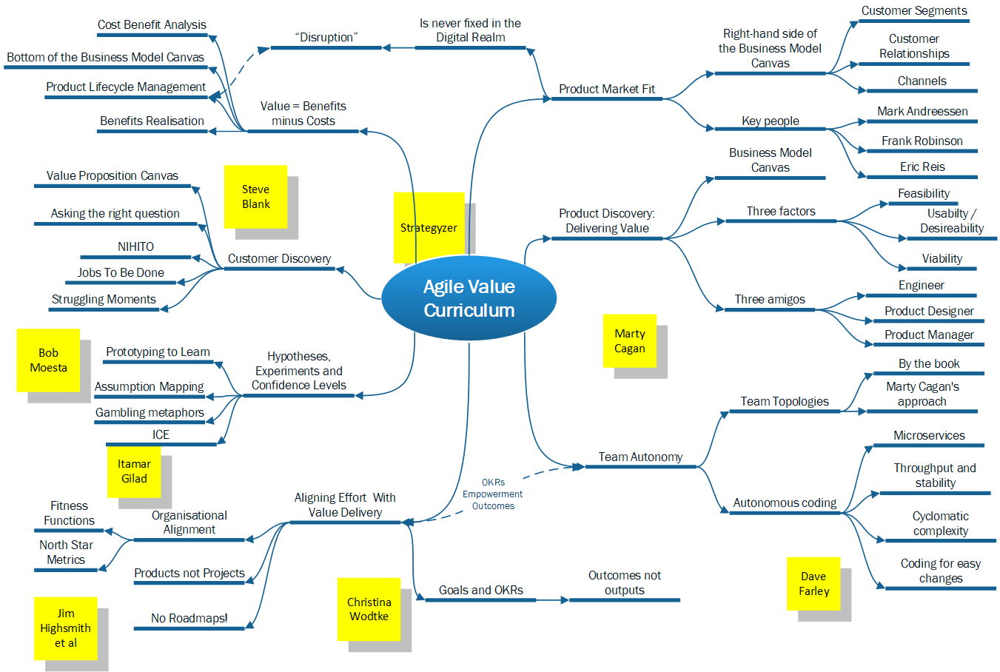

# Valuable Agility

## TLDR of the whole series

This is the third and final part of a three article series:

1. [The first part](Agile_WhatsThePoint.md) highlights the difference between capital-A-Agile and small-a-agility: a concept ~~stolen~~ [borrowed from Dave Thomas](https://youtu.be/a-BOSpxYJ9M?si=m5g_B7sa9_wK06cp). It also answers the question: "...does anyone remember what the original intent behind promoting agility in software engineering was?" ...with a resounding "no".
2. [The second part](Agile_AntiPatterns.md) has a lot of snarky fun pointing out everything that everyone's doing wrong. It bemoans the fact that agility is supposed to be about delivering *value*, above all else. And hardly anyone knows what that's supposed to mean - including quite a few people that society has decreed "incredibly successful".
3. This third and final part is where I finally roll up my sleeves and review some better ways of approaching agility with value at its core. Though it wouldn't be me without there being a bit of a moan at the end.

Throughout all three articles I use the phrase "Digital Realm" a lot. The [first article](Agile_WhatsThePoint.md) describes it fully, but a quick definition is: "... the place of frictionless, infinite possibility afforded by working with digital technology". Working here is usually very dangerous and most-often goes horribly wrong, but if you get *good* at working here it starts to offer some serious advantages over working in Real World ways.

That's what this article is about, fundamentally, and it all hinges on the concept of *value*, a word that's prominent in the Manifesto for Agile Software Development, without *actually getting defined anywhere*. Handy, eh?

## TLDR of this article

Plenty of people in the big wide world have succeeded in engineering software in small-a-agile ways, resulting in profitable and useful products. They didn't all get lucky - or at least, some of them played the percentages and vastly increased their chances of success by using strategies and tactics that:

* Used the lack of friction in the Digital Realm to their advantage, by enabling a degree of experimentation that's not possible with Real World things.
* Modelled the value of their ideas and resulting products *properly*, instead of just launching stuff on a wing and a prayer. And understood that *value* is what you have left over once customers have paid for the benefits of your product, and *you've paid* the cost of delivering it to them.
* *Really* got to know their customers, and the struggles their customers go through.
* Trusted their staff to act like grown-ups with, you know, actual brains and stuff.
* Aligned all the delivery effort in terms of *Products* that continually add value, not *Projects* that you stop at some point once some value has been added (maybe, if you're really lucky).

However - as I'm writing this in the middle\* of *the **most severe** tech bubble I can remember* (and I can remember the DotCom one), this article ends by suggesting that there might not be quite as many genuinely successful implementations of these patterns as the gurus suggest. I'm just not sure that we define "success" the right way, still - and as such *value* is still a bit problematic.

\* Actually it feels more like we're nearer the bit when it all bursts than the middle. Date of writing this: 26th August 2025 - let's see.

## Product / Market Fit

This is a fundamental concept, so let's deal with it first. It describes the small-a-agile startup's equivalent of the Holy Grail - the point at which your Product has landed successfully upon an eager (and large-enough) cohort of users and customers. The value of using it is obvious to all and sundry. Once you find that fit, you can pull money down from the proverbial magic tree.

I'm not sure the concept can be attributed to one person but [Marc Andreessen](https://pmarchive.com/guide_to_startups_part4.html) is one of the candidates. I particularly like how the article has aged since 2007: he cites "search keyword advertising" and "internet auctions" as examples of products with excellent market fit, then contrasts those with "video-conferencing" and "micro-payments" as examples of things that hadn't fulfilled their promise. As mentioned in [article 2](./Agile_AntiPatterns.md), timing is everything, innit? To be a venture capitalist is to be wrong, over and over, and yet somehow end up wealthier than God. Whodathunkit?

This for me highlights something important - product / market fit is usually defined as the Holy Grail *of startups*, but the reality is that its like nailing jelly to a wall, you might get it balanced in place for a while, but this is the Digital Realm we're in; it's fluid and frictionless, and in the unlikely event that you ever achieve a perfect fit, you won't keep it for long without constant change.

The canonical book about finding Product / Market fit is Eric Reis's [The Lean Startup](https://www.waterstones.com/book/the-lean-startup/eric-ries/9780670921607), which (clue in the title), firmly roots it all in startup culture. IIRC\* it's also where the benighted term "Minimum Viable Product" comes from (much more about that below). One risk of Product / Market fit in an investment-heavy world is that "proof of fit" can become an end in itself, can get substituted for *actual value*, the result is "jam tomorrow", faking it until you fail to make it, and [the bright young things of the Forbes 30 under 30 ending up in prison](https://medium.com/@patelmuqarrab./why-forbes-30-under-30-might-be-the-ultimate-curse-1111cfba747e).

\* Turns out I don't RC at all - it was Frank Robinson, in 2001, apparently. 

But another thing I've personally lived through a couple of times is when companies find great Product / Market fit *by accident*. This isn't as unlikely as it sounds in the Digital Realm - a great technology just finds a market "organically" and delights everyone by affording opportunities they never had before. Companies that did this include, I don't know, Nokia, for example, or Research In Motion. Or Sun Microsystems. Or Apple (nearly).

If your company is making good money out of a ground-breaking technology, but nobody can put their finger on *why*, exactly - then you're in big trouble, even if you're pulling money out of people's wallets for the time being. Inability to articulate why the cool technology is so valuable other than "it's cool" leaves you wide open to customers' "great ideas" about your product, and you won't be able to argue the toss when they insist that you start to break it.

But knowing *why* and *how* your product fits the market means being able to show and tell exactly how much extra value your product is contributing to customers' bottom lines, or the extent to which it's easing their troubles. It keeps everyone focused on constant delivery of value. It helps you notice when that value starts to dip, too (which it will), and suggests ways of fixing that when that happens.

So even if you're *not* a startup, and you have loads of customers, and robust revenue and earnings, and all that other good stuff - if you don't comprehend the fit between your products and their market, in detail - if the only market segment you're sure you're selling to is "people who buy our products", then you really ought to define your fit retrospectively (and *soon*).

## Strategy and Tactics for Delivering Value

To be small-a-agile you *have* to deliver value - it's in the first of the [12 manifesto principles](https://agilemanifesto.org/principles.html):

* Our highest priority is to satisfy the customer through early and continuous delivery of valuable software.

But the definition of value is up to you, my friend. And as I've covered in [article 2](./Agile_AntiPatterns.md), as the manifesto was written by *software engineers*, it can often be the case that responsibility for defining value is left entirely to business people. They tell the engineers "what's valuable" (sort of, rarely in a very coherent way), the engineers deliver *something* (sort of - though because the value hasn't been properly defined, its rarely anything good, and it always takes ages, and who knows how much any of it costs, really?)... And then there's a lot of passive-aggressive resentment as the wheels fall off and everyone realises it's all been a waste of time, effort and money.

It doesn't have to be this way, because the cavalry arrived a good while ago, in the form of [Marty Cagan](https://www.svpg.com/team/marty-cagan/). Marty is rightly held up one of the good Silicon Valley gurus, and his greatest contribution is to provide a snappy, workable definition of value, at long last. Hurrah for Marty!

### Viability, Feasibility and Usability / Desirability

Marty laid out his fundamental product development ideas in his first book, [Inspired](https://www.svpg.com/books/inspired-how-to-create-tech-products-customers-love-2nd-edition/), where he states that value delivery is the core factor upon which all products must be judged. (Plenty of other people have made this point, too, of course - Marty's book was just the first one I happened to read that said it). However, he also suggests that delivery of value is the responsibility of the *whole team*, not just something that Product people tell the team how to deliver.

He also breaks value delivery down into three sub-concepts, none of which deliver value on their own, but all of which can *prevent* value from being delivered if they're not properly attended to. They are:

* **Feasibility** - the technical possibility of delivering a solution in a realistic time-frame, and defining the delivery costs.
* **Usability** - whether the intended users are able to understand the product and use it easily-enough to solve their problems. This also gets styled as "desirability", too, as like it or not, there's an emotional aspect to people's decisions to use a product, though this *always* gets outweighed by how well the product eases their struggles, eventually.
* **Viability** - how well the product aligns itself with the business that's delivering it. The obvious key one of these is "how much profit is there in it?", but there are other factors, too (e.g. "is the product actually *legal*, or will company Directors end up in court if we sell it?).

These three factors can also be thought of in terms of "alignment with technology", "alignment with the market", and "alignment with the business". But the bottom-line is that all good products need to be well aligned in all three directions, all the time, and their natural tendency is to go out of whack, no matter how long they've been out in the big wide world for, and how successful they may have been in the past. The frictionless Digital Realm makes the process of coming unhinged a lot easier, too, of course.

Sharp-eyed readers will have already noticed that the three sub-concepts also align to three key roles in a Product Team, the Software Engineer, the Product Designer and the Product Manager, and Marty suggests that all such teams should be led by these three amigos - with the set of three having shared responsibility for delivering value, by balancing all three things. He further suggests that these three people should be *the only* team members to begin with, until there's enough evidence of Product / Market Fit being established to warrant increasing headcount.

He also hammers home the point that all three amigos should share a deep and meaningful understanding of *the problem the product is solving* - of which a lot more below. Indeed - pretty much everything in the rest of this article is covered by Marty Cagan somewhere or other, because he really does know his onions. Such as...

### Deliver Value Not Features

I've built so many things throughout my engineering career that just didn't get used much, if at all. Honestly: it's been enough to make me question why I bothered in the first place. Quick answer - the salary: so I've personally benefitted tremendously from delivering little of value. The people that *paid* my salary, though - not so much.

This glorious situation is endemic within software engineering, and there's a whole cabal of gurus trying to stop it. "Deliver value, not features" is the cry, a concept which obviously ties in nicely with the [toppermost of the Agile Manifesto Principles](https://agilemanifesto.org/principles.html). These days, you may also hear the same concept described as "delivering outcomes not outputs".

Whichever way it gets styled, though, I feel this concept gets a little confusing for the average software engineer, whose job is to *build things*. And you can't really *build an outcome*, can you? You have to build *the thing that causes the outcome to occur*. I'm splitting hairs a bit here, it's not *that* complicated a concept, but nevertheless the trap of defining the problem in terms of the solution we want to build is, as ever, an easy one to fall into.

So the trick is to set objectives that relate to measures of business performance, e.g.:

| The old way (outputs)             | The new way (outcomes)    |
| ----------------------------------| ------------------------- |
| Build a better checkout process   | Reduce drop-outs from the checkout from 43% to 25% |
| Create an installer               | Decrease lead-in time from decision to buy to getting up and running from 32 days to 5 |
| Make the recommendation system more accurate | Increase occurrences of cross-selling at the checkout from 12% of orders to 45% |  

The whole idea is to give creative people problems to solve, without proscribing the solutions. Troubles occur because *Product people are also creative*, so we have a tendency to try and shrink-wrap solutions and hand them over. Computer programmers can then also enable this unhelpful tendency by asking the question: "... what are the requirements?". This is often shorthand for: "...tell me what to do, then I'll passive-aggressively tell you why that's a stupid idea, before suggesting my *own* stupid idea that's also not based on any understanding of the problem, either".

Anyway, the theory of setting problems that have solutions with measurable outcomes has a name, which is...

### Objectives and Key Results (OKRs)

Intel came up with OKRs in the 80s and 90s - their CEO Andy Grove based it on Peter Drucker's business philosophy. OKRs are all the rage now, though would you be surprised if I told you [a lot of people do it badly](https://medium.com/@kmackie4/why-most-okrs-fail-and-the-fix-that-actually-works-47c500c91a6f)?

The *intention* behind OKRs is to empower your staff by leaving the "how" of delivering objectives up to them. In the frictionless Digital Realm, there's one major advantage to this: if you proscribe a solution to the team and tell them you're going to pat them on the back if they deliver that solution, they'll go ahead and deliver it even when it's clear it won't work.

In case you missed it, "agility" means "the ability to change direction quickly". So reserving the pats and tickles for when an *outcome* is delivered encourages the team to switch tactics once it's clear the original ones aren't moving the needle. Working in the Digital Realm means there's nothing to stop you doing so, other than fear, and / or your clumsy ways of working.

That's the *theory*, anyway, but empowering teams this much is a *big cultural shift*. Managers really are in the habit of telling people what to do; even the good ones do so from time to time, *because they can*. So it takes quite a lot of willpower to let go like that. The main place I've worked that tried it didn't really get it: "we're doing OKRs now" was announced with a bit of a fanfare, but before we knew it we'd fallen back into old habits of slogging through set plans and implementing business cases that defined solutions for us to deliver.

In other words, we weren't using the fact we were working in the Digital Realm to our advantage. No fault of the theory - it wasn't really given a fair shake, because management didn't get why the Digital Realm is different.

### No (Heavy) Roadmaps

The main force that holds management back from going all in on OKRs is fear of uncertainty. The artefact that most embodies that fear is *The Product Roadmap*. Our Marty Cagan *hates roadmaps*, because they're always wrong. Like all the other pickled-in-aspic, heavyweight, up-front artefacts (business cases, project plans etc), they provide a misguided sense of certainty, while going out-of-date before the ink is dry. The fundamental issue with roadmaps is: "... you can *never* know all there is to know when you write one".

This is, of course, obvious to all and sundry, so barely a roadmap has been committed to without the caveat: "...it probably won't turn out like this, but..." However, all the caveats in the world never seem to register with the Sales and Marketing teams, who go ahead and promise the customers that this gizmo will definitely cure all known diseases by that date. And in the meantime, Finance are happy because uncertainty mucks up all their sums, so they will cling to a veneer of certainty like a sailor to a piece of slippery wreckage.

Enter a couple of more small-a-agile alternatives (that at first glance seem *very similar to each other*) - [Lean Value Trees and Measures of Success](https://www.slideshare.net/slideshow/lean-value-tree-overview-82783795/82783795) - as described in Highsmith, Luu and Robinson's book [Edge](https://www.thoughtworks.com/en-gb/insights/books/edge) - and [Itamar Gilad's GIST Framework](https://itamargilad.com/gist-framework/). Both of these ideas offer methodical ways of *embracing* uncertainty, by at the very least acknowledging that we don't know what we don't know, factoring *the extent of uncertainty* into our decision-making, and centring all planning around efforts to lessen uncertainty (i.e. "to learn more about the problem") as we move towards our goals. The nitty-gritty of managing the uncertainty will be discussed in more depth below; in this section we'll deal with how both frameworks deal with planning and management.

These ideas are, at least on the surface, pretty similar as they both rely on "trees" - i.e. ways of arranging strategy, tactics and tasks hierarchically to plan and manage discovery and delivery concurrently, in small-a-agile ways. GIST maps out the route from strategy, via tactics, to solutions in a four-level deep hierarchy tree of Goals, Ideas, Steps and Tasks. It is explicitly related to Objectives and Key Results (OKRs), so the Goals are structured around the Key Result needles you have to move in an explicit time frame, e.g.: "in Q3 of this year we've got to reduce the average checkout time on our e-commerce site from eight minutes to four minutes". All organisations should manage a hierarchy of these, that align to particular "top-level" metrics (i.e. the overall ones for the company). Itamar suggests having two of these:

1. A "North Star Metric", which is explicitly the most-simply expressed (but accurate) measure of the overall value you're delivering to the market (he suggests "items consumed" as an example for a grocery supermarket, for example).
2. A "Top Business Metric", which is intended to keep all the work everyone does viable and aligned with the business. This is usually something like "increase revenue from £1M to £1.1M" or "increase earnings from 22% to 23%".

Highsmith et al take a very similar view, but are not aligned to OKRs as explicitly. Their idea of a North Star Metric is described in terms of an organisations "fitness function", i.e. how capable it is of delivering core value to customers, and suggest that this provides more scope for including intangible factors such as "inspirational quality of leadership" into the mix. So while they also suggest a four-level hierarchy from strategy, via tactics, to actual work, their "root" concept is "vision", rather than goals. "Vision", for them, is a "guiding direction towards which all investments should contribute", and goals come in at the next, main branch level. More fundamentally, while Itamar bundles the framework for organising strategy, tactics and work, and the processes of measuring success and progress, into one, Highsmith and co keep them separate:

* *Lean Value Trees* are for arranging the strategy and tactics so that small pieces of work can be undertaken independently of each other, but they all align to the Vision.
* *Measures of Success* provide the feedback that needles are being moved, and more value is indeed being delivered, as each pieces of work is undertaken.

Both frameworks insist that you should *never do too much work without checking its impact*, thus aligning fundamentally with small-a-agility. Indeed, while both seem to suggest that "you should do this in cahoots with small-a-agile Software Engineering", I'd go all-in and say that this **is** small-a-agile Software Production. These sorts of approaches: working out what value you're intending to add, how you're going to measure the next bit, taking a step towards that, then checking the impact - this *is* agility. Finally, we've got some proper control around the concept of "value" in the first manifesto principle. It only took 20 years.

Both of these approaches make a lot more sense than just bunging stuff in a roadmap that everyone knows at heart is wrong. Of the two, I think I prefer Itamar's one, because it's explicitly aligned with OKRs and is just a bit clearer. He has a couple of good suggestions about quantifying uncertainty (the Confidence Meter), and planning around it (Impact, Confidence and Ease, or ICE) - both of which I'll dip into later. The upshot of Itamar's approach is an *Outcome Roadmap*, a neat idea that re-works the roadmap approach from: "...we'll deliver *this feature* on this date" - to: "...by this point we'll either have moved the needle on this metric to this point, or decided that there's a whole better way of defining it, and done that instead".

Itamar's not against putting *actual feature delivery milestones* on the map, either - but **only** when confidence that the feature in question is going to produce the required outcome is *extremely high*. All the rest of the work that a Product Team conducts is in service to either increasing the confidence level of each idea until its delivered, or establishing that the idea ain't that great, and canning it quickly before you waste any more time on it. Like Marty, Itamar is behind the Engineer, Designer and Product Manager trio idea, too. Oh and another neat idea is that the point of delivery isn't actually "maximum confidence", either - that comes after you've been running the product in the wild for a while. Though IMHO it **never** comes, because frictionless Digital Realm etc etc. As soon as you think you know it all, something or someone will drive a coach and horses through your comfortable certainties.

Highsmith et al are stronger when describing  *what all the levels of middle management are for*, still, once teams are generating all the ideas. They go into a lot more detail about how to *govern* these team-centric approaches, and how the "upper-echelons"\* should manage the "visionary" bits at the root of the Lean Value Tree. I don't recall either book suggesting how to *account* for them, though. In theory it ought not to be any harder than setting up a big project budget after a lot of inaccurate up-front planning, but both approaches are going to have to get over the hurdle of telling finance "...we don't know *exactly*" when they ask "... what are that team going to be doing for the next 9 months?". OKRs tell us that the answer should be "reducing (or increasing) that number from X to Y", of course, but there won't be any "how" in the answer. Itamar's suggestion for dealing with this situation is to point at all past failed predictions of "they're *definitely* going to deliver this thing, which will *definitely* solve this poorly-understood problem", and asking "shouldn't we try something different, maybe?". This seems logical, at least.

\* In spite of hierarchies being flat, of course.

## Estimating value with a business model

My [PhD Literature Review](https://repository.lboro.ac.uk/articles/thesis/Does_the_way_museum_staff_define_inspiration_help_them_work_with_information_from_visitors_Social_Media_/9496598?file=17123216) suggested that epiphanies are a myth, but I came pretty close to having one of my own in 2018. I was working in Cambridge University Library at the time, and the research team I was part of had been tasked with writing a business case for two separate IT procurements. Pretty much everything we were doing was wrong - it was all very heavy on solution without having delved too much into the problems we were supposed to be solving; in fact everyone had decided what the solution was before we'd been hired, even.

However, as part of the rigmarole of getting a system in place, we had to write a business case, to a strict template which also required a business model. As I'm really not scared of looking stupid, I put my hand up in front of the chief IT Programme Manager and out-and-out asked him to explain what one of those was (I think the sentence I used started with "I know I've been in the computer programming business for 20 years already, but...")

He gave me a kind of chuckle that indicated I might not have been the first geek to have asked him this question, then showing tremendous patience, he sat me on his knee and walked me through it. This was when all sorts of things that had been brewing in my addled brain for the previous ten years or more (not least the damn PhD itself) finally clicked into place. Incidentally - this is what an "epiphany" is - there's not much mystical about it, it's just the last couple of neurons between different parts of your brain making a key connection - but when it's one of those ones where the connection is *really* key, you can kind of feel it, physically.

What Chris showed me that afternoon was that is was possible to estimate the relative values of bits of an Information System in order to prioritise which one to build first. This is, of course, *the* most fundamental part of being small-a-agile, but I've not found a single book that tells you this (maybe "the Lean Enterprise"?). Instead I had to wait for 12 years after writing my first Unit Test for Chris to tell me. And try though I might throughout the following decade or so, I haven't found many other people that have been through the same "epiphany", either: it's like some sort of Magic Circle thing.

On the flip-side, the version of business modelling Chris taught me was really, *really* slow, and still based on special assumptions made by "experts" up-front. Chris did at least explain a technique where you had to note those assumptions explicitly, make the figures easy to change, and even Monte Carlo it all if necessary, but it was all very heavyweight and up-front. In his defence, Chris told me that he loved small-a-agility but that the IT function at Cambridge had made so many bad fists of implementing capital-A-Agile in the past that it was practically a swear-word in his department, so he had to do it by stealth, and given that the institution is over 800 years old, taking six months to produce a huge up-front business case is kind of being agile, anyway. But he *definitely* got the value bit - in particular the bit where you map benefits onto features of the system you're proposing so you can work out which ones are worth doing, and what order to do them in.

However, the insistence that we spend *so* long toiling away at it without, you know, *testing* any of the numerous assumptions we were working with rankled really badly with me, so I set out to find a more small-a-agile approach. Enter [the Business Model Canvas](https://www.strategyzer.com/library/the-business-model-canvas).

### The Business Model Canvas

The Business Model Canvas is provided by a consultancy firm called [Strategyzer](https://www.strategyzer.com/) and at least in part came about as a result of PhD research by a chap called [Alex Osterwalder](https://alexosterwalder.com/). I landed on it after finishing my work at Cambridge, while I was searching for a small-a-agility business modelling method, and in that respect it really fits the bill. You can, and should, get a Business Model Canvas together within hours, or minutes, of working up your next brilliant new idea that's going to bring the Digital Realm to its knees.

Or, if, by some *miracle*, you've got twenty years into a successful product suite, without ever working up a business model of any kind, you should immediately drop whatever nonsense you're up to and start drawing one up. (Remember from [article one](Agile_WhatsThePoint.md), everything has a business model in the same way everything has a design - if you haven't thought about it explicitly, it'll almost certainly be a bad one).

Rather than go into massive detail about it, I'd just recommend buying [the book about it](https://www.strategyzer.com/library/business-model-generation), as well as the two follow-up ones about Value Propositions and Testing Business Ideas, too (more about those later).

The Business Model Canvas seems to be heavily associated with startup companies, though as I say, in IMHO there's no *real* reason why, the most likely is that a detailed method for using it in full start-up mode was published by [Steve Blank](https://steveblank.com/) in his book [The Startup Owner's Manual](https://steveblank.com/startup-owners-manual-1in/). This goes full-gas about how to use it to find product market fit and work the odds of success in your favour, and as such I think it can usefully be applied whenever you feel you need to change a product at any stage of their lifecycle. Should no business modelling work have been done on your products already, then following these processes to put one in after the fact is really going to help you manage the rest of its lifecycle, and get your products under control.

Working out the value of your work methodically and scientifically is *not just for start-ups*, which is a good job, given how many serious problems there are with start-up culture (more later).

The thing that most annoys me about the Business Model Canvas is that it's not made clear enough that *you're supposed to run numbers through it*. The book Strategyzer wrote about it doesn't come out and say this outright - indeed you have to wait for Alex Osterwalder to get [twenty-five minutes into this key presentation about it](https://youtu.be/8GIbCg8NpBw?t=1510) before he reveals this vital point. I put this down to the barrier between business people and software engineers that I describe [in the first article](Agile_WhatsThePoint.md) - neither group understands how little the other group knows about what they do, and people with a foot in both camps are rare.

For clarity's sake: **you're supposed to run numbers through it**. Most people from Osterwalder's side of the fence know this, because it's clear from the name - it's a *Business Model* Canvas. So the two boxes at the foot of the canvas - the Cost Model and the Revenue Model, form the Cost / Benefit Analysis you'd find in a more traditional model. Indeed, you'd probably want to start building out a more traditional model you can plug *real* numbers into once your Product takes off - but the key is to *not waste time at the start over-modelling things based on really wild assumptions*. Instead, you can explore costs, benefits and the other key parts of your model *within about an hour of starting to get your idea off the ground*, instead of, er... **never** (which is the approach taken by [95% of benighted attempts at getting profitable software into the world](https://fortune.com/2025/08/18/mit-report-95-percent-generative-ai-pilots-at-companies-failing-cfo/)).

### How the Business Model Canvas can provide focus and direction

If you've waded through [article 2](./Agile_AntiPatterns.md) then you might have found some links to [Sebastian Gebski's critique of Domain Driven Design](https://no-kill-switch.ghost.io/the-failed-promise-of-domain-driven-design-part-1/), where he provided these two typical examples of the sort of design trade-off that DDD provides very little help with solving:

* Should "discounts" be a part of "item pricing"? Depend on it? Or the other way around? And the "basket discounts"? And the "volume discounts"? And ...
* What would be the best way to organise courier delivery? Around "courier availability", "routes", "scheduled deliveries", or "availability in the vicinity" (these are four different perspectives on the very same data)?

I added my weight to this by suggesting that it's *extremely unlikely* that any business person alive would be able to provide a sensible answer to either of these questions outright, but that this is precisely the sort of logical twister-game that software engineers often put them in. I also promised that I'd re-use these examples to explain how the Business Model Canvas might provide a useful point of reference to help answer them. So here goes.

The answers to both questions depend on the right-hand side of the canvas, in particular "Customer Relationships", "Customer Segments" and "Channels", and also the "Revenue Model" at the bottom. In the case of "how do we model discounts?", the bulk of the answer is covered by "Customer Segments" and "Customer Relationships". If you're working in a niche, business-to-consumer segment and only intend to have intermittent relationships with your customers, but your revenue model involves trying to get rid of stock quickly (as a lot of them do), then you'd tend towards modelling discounts at the item level. If you're stocking items with the intention of cross-selling them, and you also want to build long-running customer relationships by making them feel more valued, and that they're being canny and getting a bargain, perhaps you'd go for discounts at the basket level. Whereas if you're selling wholesale to tradespeople in more of a B2C model, you'd go for volume discounts.

And as to which way around to model the dependency - that would depend on just how big a part of your relationship with the customer discounting is going to be: if you're after an exclusive-feeling relationship with a "high-end" segment, you ain't going to be discounting much, so you'd make the item the dominant class and have discounts depend on those, whereas if you're intending to pile any-old-stuff up high and sell it cheap, then it becomes all about the discount and the items themselves are secondary.

The second question brings "Channels" more into the picture, as its specifically concerned with how your product is going to make its way into customers' hands. But it also has its foot in the Revenue Model, too: if you're selling lots of small widgets to thousands of customers and they're all putting in multiple orders a week, courier availability sounds like a better option, whereas if you're delivering pre-fab home-working sheds that need craning over peoples' houses, the route takes on a lot more importance.

The way the Business Model Canvas works, here, is that it gives both the business people *and* the engineers a point of reference to answer these sort of abstract questions; one that's based on *working with the customer* and *delivering value*, rather than just insisting that abstract logical questions get answered on the spot devoid of any context. The engineers need answers to questions like these (honestly, they really do), but often lack a framework to help business / product people answer them. The Business Model Canvas provides that sort of framework.

There's more below about how aligning with value delivery provides a much better footing for isolating team work than DDD ever could.

### Uncontrolled costs

I mentioned that costs in the Digital Realm are seriously out of control in [article two](Agile_AntiPatterns.md). I think the whole topic is seriously undercooked in the product world, too. I've done the foundation piece of [Pragmatic](https://www.pragmaticinstitute.com/product/) training, for example, and while it's really good and gets a lot of key things absolutely right, their [Framework](https://www.pragmaticinstitute.com/product/framework/) has *thirty-seven* boxes on it (gulp!) and "costs" is nowhere to be seen (I expect it falls in the "business" column somewhere but just should be more obvious). Similarly, Marty Cagan buries the concept of costs in his discussion of "Business Alignment" / "Viability" - so it *is* in there, but not as explicitly as it should be.

Hence: *do a Business Model Canvas* - the whole left-hand-side is "costs", really - and getting it all understood and under your nose *from the very start* is why you need engineers / technicians to be at the table. Good technicians will have something useful to say about the whole model, but the costs side is where they really contribute.  

To reiterate: value is *actually* **Benefits minus Costs**, and Digital Realm work *really* struggles with this. We don't have to look any further than [this utter car-crash](https://markets.businessinsider.com/news/stocks/ai-stocks-risk-nvidia-gpus-blackwell-tech-outlook-depreciation-accounting-2024-8) for evidence. (TLDR - if you buy $ Billions worth of GPUs in one go, when new / 'better' ones are being released all the time, then the value of your CapEx tanks a lot quicker than you're probably accounting for...)

## Customer Discovery

I mentioned Pragmatic above, and as I say, they nail the fundamentals when it comes to product - it's *problem, problem, problem* all the way with them - and more power to their elbow. They also have a great mnemonic: NIHITO - *Nothing Important Happens In The Office*, mirroring Steve Blank's chief slogan: *GET OUT OF THE BUILDING*.

However - to paraphrase [article two](Agile_AntiPatterns.md) - the biggest, stupidest anti-pattern in the whole of Product is people sitting around pretending they know what their customers / user base are like, or what they do, without ever spending any time at all anywhere near them. This still seems to go on all over the place and it's the absolute dark-heart of everything that's still wrong with the whole IT business. Just **STOP IT**!

The second-most stupid anti-pattern is *asking people the wrong question* if / when you do go to see them. And that wrong question is: *"...what do you want?"*

This question is a lot worse than useless, because 99 times out of 100 the person you're asking is crazy / misguided enough to think they know the answer. Indeed one of the main reasons people don't actually go out and see customers / users in the wild is because one of them has come into the office with "what they want" on the tip of their tongue. They're desperate to waste your time and money.

Of course, even though it would often be a lot cheaper, we shouldn't hide when they do - time in the presence of customers is the most valuable and important thing (see Marty Cagan again - at least an hour every week with a different one, and *take an engineer with you when you go*). But if we want to get to the *actual problem* and avoid all the waste, we have to *reframe the question* from "...what do you want?" to: *"...what were you doing?"*

People just can't answer "what do you want?" truthfully. If they genuinely knew what the solution to their problems were, they wouldn't need you, would they? They could solve it themselves. The issue is that they don't even know in enough detail what their *problems* are... But *everyone* can tell you *exactly* what they were going through when they suffered the problem, in extreme detail. Just ask the question people can answer easily, and truthfully.

This clever re-framing idea has emerged in a few places. From the more technical end of things, it's at the core of [Event Storming](https://www.eventstorming.com/), for example, where you work through scenario timelines with the people that have the problem you believe you can solve. Strategyzer are all over it, too - it was always right in the middle of the Business Model Canvas, but took up so much room that they invented the [Value Proposition Canvas](https://www.strategyzer.com/library/value-proposition-design-2) to cope.

The absolute best guide to asking the question properly, though, is Bob Moesta's [Demand Side Sales 101](https://www.demandsidesales.com/). The reason it wins is that is aligns the question with, er, *Sales*. And, well, perhaps I've just been unlucky, but wherever I've worked Sales have always been the biggest ~~pain in the arse~~ disruptive influence to the smooth running of things. Because they've *always* sold stuff that **wasn't actually the product**. Which from an engineering pov means *having to tweak the product to fit the sale* every time. Which, because it's the Digital Realm, is *always possible* but *never a good idea*. Such tweaks are [how all the Technical Debt gets into products](https://youtu.be/d2Ddo8OV7ig?si=aQmErwkglXuD-Qyx), meaning *each time it happens, it makes the next tweak harder to deliver*. Before you know it, everything's seized shut, and all Sales can do from then on is make your company look dumb.

This is *not Sales' fault*, of course - it's a capitalist world (still, just about), and if they didn't sell you wouldn't get paid. The issue is that it's often not clear enough *why* the customer should buy the product, so Sales have to "elaborate" to a greater or lesser extent (always greater). Bob Moesta twigged this, then (as he's a proper engineer), he put his boots on the ground to find out the cause of the problem. He got himself a sales job, selling kitchen work-surfaces in a local hardware shop. And from day one got completely into the trap I've described above, and nearly brought the company that hired him to its knees, by promising customers undeliverable things in order to make sales.

Bob's book describes what he did to fix the problem, and it's the one I'd recommend the most of all those I've mentioned in my mega-rants. It's pretty simple, and the core simplicity hangs on asking the easy-to-answer question. Which, in common with the Value Proposition Canvas, comes from...

### Jobs To Be Done

I'm not too well-read on [Clayton Christensen's underlying philosophy](https://hbr.org/2016/09/know-your-customers-jobs-to-be-done) other than what Bob Moesta says about it (he was a big part of coming up with the underlying idea), but I believe there's a suggestion that it helps to think in terms of customers just "hiring" your product to do a job, and they'll keep hiring it until they find one that does the job better. There's an overlap with Product / Market fit here - your product doesn't necessarily have to have *perfect* fit, as long as it's better than the competition - but obviously the closer the fit, the harder it'll be for the competition to better it. The key thing is that we define the market, and the fit that the product has with it, in terms of the *jobs people are trying to do*, or in Bob's terms: *the struggles they are having*, and not *the people themselves*, which is the more traditional approach to marketing, and enshrined in things like Personas etc.

Incidentally, it's this tweak to "struggle" rather than "job" that aligns Bob Moesta's ideas up better with Sales / Go-To-Market, because what he calls "the struggling moment" is the point a customer is most susceptible to the idea of switching to a better way of getting their job done. Thus the key to good product marketing is to find these moments and ensure your market are aware of your product when they occur, and also provide a satisfying solution to the struggle, of course.

### The Value Proposition Canvas

This is another Strategyzer artefact, that is literally central to the Business Model Canvas, and ties the whole business model to the value you're delivering. They realised they needed it when the "Value Proposition" boxes in the middle of everyone's canvases started overflowing in tsunamis of sticky notes.

This idea is also based on the Jobs To Be Done approach, though it doesn't dwell on the "you're just renting the product" idea. Instead it formalises the process of defining the job that customers and users are trying to do, looking at the pain points around getting the job done, and how your shiny new technology can relieve them. But the Value Proposition Canvas also encourages you to focus upon the extra (often unexpected) gains that could be achieved by implementing the new technology in the form of "gains" and "gain-creators" - the aspects of the technology that (in Don Norman's terms) "afford" new opportunities that didn't exist before.

This is the whole "disruption" thing (also a Clay Christensen idea) writ large, and is *very* aligned with the Digital Realm and the whole Silicon Valley philosophy of "breaking things" which underpins lovely organisations such as Uber, Deliveroo / DoorDash, AirBnB etc. So at this point, I really, *really* get it, but start to get a bit sniffy about it all, too. There's just something *antisocial* about the idea of "disrupting" things that sticks in my throat a bit (see below), particularly when the things you are breaking are civil societies, or "the environment", or cities full of dehumanised people...

Who do you think you are, Sham 69? (Yes, probably).

But, as with everything I've put in these three articles, the Digital Realm helps you "disrupt" things (should you wish), because of the whole "infinite possibilities" and "lack of friction" schtick. Problems occur when the numbers on the screen that are supposed to represent how people live and behave actually replace the people themselves. At this point, your OKR about reducing the average delivery time becomes a herd of people on e-bikes weaving in and out of pedestrians at (literal) breakneck speeds. I guess what I'm saying is that there's no substitute for *actual field work* - digging into what's going on behind the numbers. In other words - NIHITO / Get Out Of The Building! But this bit would be better off coming at the conclusion?

## Hypotheses and Experimentation

As mentioned in the section about alternatives to roadmaps - if we want to start using the frictionless, infinite possibilities of the Digital Realm to our advantage, or in other words, if we want to be genuinely small-a-agile, we need to *embrace uncertainty*. And that means *getting all scientific* - not "delivering outputs" but "testing hypotheses of value" to see which ones move the needle on our Key Results the most.

There's a big caveat to all of this good stuff: to experiment properly you *have to be good at experimenting*. I.e.: you should have at least an affinity with scientific methods. It's quite easy to conduct "experiments" that simply exist to confirm your biases, so an inability to at least try and remain objective about results, and failure to acknowledge that experiments that turn out exactly as expected are as rare as hens' teeth, put all the good intentions behind experimentation at risk.

Never forget: a *successful* experiment is one that turns out unexpectedly. To know this is to work in the mode of "Falsifiability" - that the odds your idea is right are pretty-much always outweighed by the chance it's wrong, so it's much less effort to go looking for proof it ain't going to work. Don't blame me, blame [Sir Karl Popper](https://en.wikipedia.org/wiki/Falsifiability). This is the kind of stuff you learn at PhD school - no good thesis is complete without a paragraph on "induction vs deduction" and all that jazz. Popper's simple example of falsifiability involved the hypothesis "all swans are white" - which to verify would involve checking *all* the swans. At which point, it's much easier just to find a black one and disprove the statement.

So in other words, it's much less effort for a team to recognise their biases and then going looking for the proof that those are wrong, than to just try and confirm them. You're always going to be able to confirm them, that's the point - but doing so rarely takes you anywhere good. OKRs are intended to help here, because the KR bit gives you the needle you need to move, and that's all a lot more objective than just "we love the stuff we built, it's bound to work, because we're so clever, innit?"

### The Dreaded MVP

I scratched the surface of the Digital Realm's most poorly-understood-concept in [article 2](./Agile_AntiPatterns.md). To sum-up, I described them as Maximally-Non-Viable-Projects, which is what they usually revert to in the hands of people that don't get the point of them (i.e. practically everyone).

My suggestion is to actually think of them as "Unit Tests of Value" (not my idea, wish I could find the person who said it first)... I.e. the (genuine) minimum amount of work you need to do to *disprove* something is going to work. One "MVP" equivalent of this, as a very first test, is to look at your grand product idea, then lean on the Business Model Canvas to hypothesise a market segment that will have struggles your product is going to solve. Then the test is to try and list 20 people or organisations that are strong candidates for having that problem. If you get stuck around ten, your idea might not be as great as you thought. If you do this work *with an Engineer and a Designer* present, they'll be able to get creative with the new information you've gained from this market research and suggest ways of tweaking the idea until you do have 20. (Call this "pivoting" if you like. The Engineer might want to call it "changing the first Unit Test of Value until it passes", if they know what they're doing.)

(As I say - I didn't invent this. I suspect it might have come from Google's [Design Sprints](https://www.thesprintbook.com/the-design-sprint).)

That's MVP one done, by lunchtime on the first day. It's also the first bad idea of the nine-out-of-ten bad ones put to bed, too. Well done! Have a guess what MVP two might be? That's right - coming up with an elevator-pitch-sized description of the *problem* you think your tweaked idea is going to solve, then calling the 20 people / companies you identified in test 1. Can't find six that are interested? (Or indeed, can't find one in the first three that doesn't immediately tell you to clear off?) Guess what - your idea still isn't right - *pivot again*.

Remember to ask the question right, though... So it's not: "...what do you think of this great idea of ours?" It's "...we think we've found a solution for this terrible problem. Is that a problem you struggle with? If so, could you spare some time to walk us through the last time it happened?" If you get outright "no it's never happened to me and I don't care" from more than three quarters of the people you speak to - probably best to consider canning the idea outright.

Anyway - that's two MVPs done by the end of day one, and a whole combo of Product Manager, Designer and Engineer that understand the customers' struggles about 5000% better than they did at the start of the day. If the idea's got legs then you should have also booked-in time with 6 people / organisations that struggle enough with the problem you think you can solve to be willing to walk you through it. Establishing a timeline of the problem with the first three on your list - no solutions, just take them back to the time they last struggled and stepping through it - is MVP number 3.

If you're doing it right, MVP 3 will be a product that reframes the struggle in your *customers' language*, not yours. But you should still only be talking to potential customers about *the problem* at this stage. Use the next three sessions you booked to validate the language you've reframed things in.

If you've hit a really good idea then you ought to get through six sessions in a couple of weeks, and still have half-a-dozen people who are willing, nay eager, to see what you come up with in terms of a solution. Of course, it's unlikely to go this smoothly, and you'll have tweaked and pivoted a good few more times, or more likely you'll have disproved that your idea is going to work by now. But if its still got legs, and you've got "the struggle" mapped out and timelined in the customers' language, then you can start thinking about prototyping a solution (the designer and engineer will probably not have been able to stop themselves from doing this by now, anyway, if you really have landed on a genuine problem to solve).

Then MVPs 10 - 30 are a case of taking the solutions back to the market again, once again walking through the timeline of the struggle, and testing how the solutions line up with it. In [Dave Thomas's terms](https://youtu.be/bEMg9XXIcew?si=WMmJucZFqZma3xt0) - these are the smallest steps you can take with an idea before you get feedback - and (important point), small-a-agility can simply mean "backing-up to the previous step if you find out you've done the last bit wrong". If you're ever doing so much work that you'd be upset to can it when it's wrong, then your steps are too big, and you've fallen too in love with a particular idea.

You'll note that this is all very "start-uppy" so far - but this approach can (and should) be applied to any suggested change to a Product. The difference with existing products is that you should already have a market segment in mind, and a set of customer relationships in place, so finding people to test the problem your change is intended to solve *ought* to be easier.

If you *don't* have a well-understood set of market segments your Products are designed for, and no intimate understanding of the jobs your products support, and the struggles your customers suffer, then get those in place **NOW**, as your *business is a risk until you do*. Any changes you put in without that understanding are 90% likely to be bad ones, that'll disturb the delicate balance of the value your products are somehow delivering by accident.

### Uncertainty and confidence

There's a recurring theme in modern software production that is fundamentally linked to the core Digital Realm concepts of infinite possibilities and lack of friction. The theme concerns the level of confidence we have in our ideas, which can also be thought of as the degree of uncertainty surrounding them.

Obviously, how sure we are about things is not a particularly *digital* idea - it's more fundamental and abstract than that. The digital bit is that, because of the lack of friction in particular, we can potentially *do more with* our lack of certainty: we can acknowledge it more fully and explore "what we don't know" more comprehensively. This is the concept of "discovery", referred to in a few places above: Marty Cagan's *Product Discovery*, and Steve Blank's *Customer Discovery*, for instance. This is a big topic, so below is just a brief overview comparing three approaches from three different sources already mentioned above:

1. Itamar Gilad's GIST Framework
2. Lean Value Trees (LVTs) and Measures of Success (MoSes), as described in Highsmith, Luu and Robinson's book Edge: Value-Driven Digital Transformation
3. What Bob Moesta describes as: *The 5 bedrock skills of innovators and entrepreneurs*, in his book [Learning To Build](https://www.learningtobuildbook.com).

How the first two help planning and management by arranging strategy, tactics and tasks hierarchically was introduced above. We also met Bob earlier, too, in the sections about Customer Discovery and Jobs To Be Done, where he introduced the idea of "Struggling Moments". But Bob's got more in his locker than just that.

### Goals and Ideas

Itamar's approach to uncertainty is all about "confidence levels". Once we're decided upon the Goal we're trying to reach, defined in terms of the value we're trying to deliver to the market, and quantified in the Key Results we think represent those Goals, we can start to consider the *Ideas* we're going to launch to get to the Goal. There are three important aspects of all ideas (not just Itamar's Capital-I-Ideas) that we should always remember:

1. *Most of them aren't any good*.
2. ... however, if you reject one that *seems bad*, but then a competitor goes off and makes 10 billion Simolians with it, that can be career-limiting.
3. The Digital Realm lets us test lots of ideas, quickly (at least in theory).

So GIST provides a framework for the evaluation of Ideas, the processes of testing quickly, and a methodical way of knowing where each Idea stands in the big picture. Itamar calls that approach *ICE*: Impact, Confidence and Ease, though confesses it should be "IEC", because "Confidence" means "how Confident are we that we've got Impact and Ease right?"

Impact and Ease map nicely onto Marty Cagan's ideas:

* Viability maps directly onto Impact - how well is this going to land in the market? How much is it going to move our Key Result needles? How much value is it going to deliver.
* Usability / Desirability kind of fits between Impact and Ease... How well is this Idea going to resonate with the market? Does it map clearly onto the problems we're trying to solve? Does it all flow nicely from our organisation into the minds of customers and / or users?
* Feasibility maps directly onto Ease - how much work are we going to have to do to deliver it? How closely does it align with technologies we're already masters of?

As for Confidence, Itamar's built a thing called "the Confidence Meter", which is a tool for assessing whereabouts each Idea stands currently on a spectrum of "we know *nothing*" to "we're so all-over this problem that we've built a solution to it that we're virtually certain is going to work". Every step on the road between both ends of this spectrum represents some form of testing that can be performed with your market, with things like "we've come up with a pitch deck that a Sales Person thinks might resonate with customers" at the "we know nothing" end, and "we've got two versions of the UI deployed in an A/B experiment and are monitoring how well each moves the metrics we know matter most" at the "we're pretty confident" end. As mentioned, we never really get to "supremely confident", though, because the market is a slippery old thing in the Digital Realm.

### Making Bets

Highsmith et al's framework of Lean Value Trees appears to be very similar to GIST, but there are some fundamental differences. One of those is that the two hierarchies don't map exactly onto each other. GIST's hierarchy supports the entire process of taking strategy into a working product: Goals relate to the very highest, "North Star Metric" level, and Tasks correspond to actual work items in a backlog for a delivery team to chew through. In Highsmith's model, "Vision" sits at the very top, and the "leaves" of the Lean Value Tree are "Initiatives", which are still one level away from any actual work that a delivery team might do.

One benefit of the slightly "higher" level of abstraction of the Lean Value Tree over GIST is that it sits it closer to the process of funding initiatives. I strongly suspect that Highsmith et al have spent more time closer to "the C Suite" than Itamar, and conversely he's spent more time nearer the coal-face. So I'm not really knocking what they're saying too much: we're all still capitalists (for now), so working out where the budget for all those expensive engineers, and designers (and Data Centres) is *very* important.

Highsmith et al model uncertainty in terms of "Bets". They define a "Bet" as "hypotheses of value that the organisation believes will help it realise a goal".

So already I don't like this. "Hypothesis" is a scientific term that's not about "belief", per-se. It's an acknowledgment that there's *something we don't understand*. This in turn comes with a degree to which you don't understand it, and that degree determines the type of experiment you need to do next.

I understand *why* Highsmith and co have taken this approach - it's a perfectly healthy understanding that we don't know the future, and that the lack of friction in the Digital Realm helps us discover it methodically as we go. Highsmith himself sums this up wonderfully: "following a plan produces the product you intended, just not the product that you need". Your original intention was wrong, because you didn't know enough.

Highsmith et al suggest a template for a "hypothesis": "We believe that by *doing this thing* we will *cause this valuable outcome*. We will validate this idea by *performing this action*." An example they give relates to the Goal of "being the market leader of retirement solutions", where the Bet is defined as: "We believe that *by providing low-cost advice to people prior to retirement*, we can *help customers better achieve their retirement goals*. We will validate this idea by *introducing a specialist advisor*..."

For my money this concept of "Bets" is a broken metaphor. It's clunky, and it doesn't really represent the real nature of a "bet". You bet on something when you're presented the odds of something happening and you reckon they've been worked out wrong. At this point, you are *certain* that you understand the probabilities better that the person presenting the odds, and you're prepared to risk your money on the fact the chance is greater than your opponent believes them to be. It's got nothing to do with hypothesising, really, which is about learning more about things that are only partially understood. Being humble, in other words, and admitting that you don't know everything. When gambling, both protagonists each think they already know more about a given situation than the other. GIST's "Confidence Levels" encapsulate this situation a lot better than "betting", for me.

When it comes to measuring whether or not a "Bet" is paying off, though, Highsmith et al get back onto slightly less shakey ground, with their concept of "Measures of Success". Again, fundamental difference with GIST, here - in Highsmith et al's world, measurement is kept separate from the organisational structure, while it GIST it's a fundamental part of it. There's some good stuff in the Measures of Success framework about Leading and Lagging Indicators: Goals (at the higher level) tend to be measured by Lagging ones: metrics that take a while to pay off, such as "losing weight" or "increasing earnings", while Leading indicators (things you can measure immediately, such as "amount you'r eating" or "revenue you're bringing in") are better measures at the lower "Initiative" level. The idea is, of course, that you want changes in the lower level to impact those higher up in a good way.

### Prototyping to Learn

Bob Moesta has an entirely different approach to uncertainty, though it starts from the same position of "we need to deliver outcomes not outputs", and that the outcome should be value to customers in the market. In Bob's world, that value relates explicitly to "struggling moments", i.e. the points at which (in JTBD parlance), potential customers are most likely to want to hire your solution. However, this is only one of five "bedrock skills of an entrepreneur" (I've highlighted the two that most relate to uncertainty):

1. Empathetic Perspective
2. Uncovering Demand (this is the Struggling Moment one)
3. *Causal Structures*
4. *Prototyping to Learn*
5. Making Tradeoffs

Bob's a born-and-bred engineer, who was mentored by some of the key figures in the Lean world, so he's a big systems thinker. As such, he's got a systematic and statistical approach to dealing with uncertainty, based on understanding the problem, the potential solution, its context and the causes and effects of the phenomena that relate to it. In particular, he's big on understanding the contextual factors that impact a system, and working out which ones can be controlled and which one act as noise. Noise factors have an impact, but are either completely uncontrollable, like the weather, for example, or public opinion. Or noise just costs too much to control: the example Bob uses is the level of humidity in a factory, we could control it but would have to install hugely expensive air-conditioning.

Once you've worked that model out (that's where *Empathetic Perspective* is needed), you can use *Prototyping to Learn* to quickly cover *all* the variables in your model in the smallest number of experiments possible, and use statistics to get the balance of your solution correct. The example Bob uses in his Learning To Build book is a optimising the design of a catapult based on distance and accuracy of the projectile, using the control factors of the amount of elastic you use, the angle of the throwing arm and the type of projectile, with noise factors relating to distance, accuracy and cost . Then one orthogonal array based on how variance in the three control factors affect the noise factors can be used to work out how to explore the whole solution space in the smallest number of steps. (E.g. if we use more elastic then the distance potentially increases, but it costs more, type of thing).

This is the major difference in Bob's approach to the other two - Bob is *very sniffy* about A/B test baby-steps: the "... has this one change to this one variable moved the needle in the right direction?" approach of the other two frameworks, as he considers learning in this way to be inefficient when we can explore the solution space more efficiently and methodically.

On paper this makes a lot of sense, but in reality *we can only go for a big bang test suite if we're certain we've got the right model of the system*, and in the Digital Realm, such certainties are rare. They're not completely unheard of, though. For instance, we might need to consider the best design for a technically complex sub-system in our solution somewhere. At this stage, Bob's approach to modelling that sub-system and working out the best balance of control factor inputs (e.g. patterns within the code that a containerised process runs) to minimise the noise we're most worried about (e.g. throughput of data that the process is required to chew through) would be ideal.

There's another intriguing idea, too - perhaps the Business Model Canvas could be representative of the sort of system Bob suggests we model? We can control our Revenue and Cost Models, and Delivery Channels, for example, but Customer Relationships and the nature of Customer Segments are both a bit more "noisy". So rather than iterating through models quickly, dealing with one variable at a time, we might explore a whole heap of models in one go? We'd need to simulate the product's behaviour in the market at that point, though... So this is starting to sound like the basis of a whole PhD, though, and I've already got one of those, thanks. If someone else wants to do it then fire away.

Fundamentally, though, all of this "Bobbishness" represents a big stride away from small-a-agility, as it all tends towards "big design up-front". I believe this to be evident from the work Bob's done in the Digital Realm (quite a bit of very successful stuff, with Basecamp in particular), which tends to lean more towards the JTBD aspects of his expertise and encouraging people to align their digital products up with Struggling Moments and increase the desirability of their products more methodically. Bob has a very optimistic attitude to working out costs, too - pretty much claiming that they'll be "self-evident" in a lot of cases - a claim which I think rings a lot truer when we're building real things with actual materials and production lines, but which is definitely NOT the case in the Digital Realm, where the de-facto approach seems to be: "we'll work out what it costs when Jeff sends us the bill".

To sum up, as I say, I don't like the gambling metaphor much, but just to prove how big a hypocrite I can be, I'm going to use it now. Itamar and Highsmith et al are playing Blackjack. They're turning cards over one at a time, then reacting to the next card. The Digital Realm and small-a-agility lets them turn the cards over quickly, but a lot of cards have to be turned over, potentially, before either of them have won enough to leave the table.

Bob is playing roulette: so he's covering the table in bets and using a smaller number of rolls to try and beat the house. However - he's not *really* playing roulette, as that would suggest he's working on pure chance, whereas what he's *actually* doing is working out *exactly* where to place his bets to win money every time. So this is where the whole gambling metaphor starts to fall over. Told you I didn't like it.

Bob's *actual* gamble is on whether the model of the system that's being used to work out where to place the bets is the correct one. That's a lot less of a gamble in the Real World of physics, gravity, catapults etc, but much more of one in the Digital Realm, where there's nothing physically stopping us from modelling anything anyhow.

### Assumption mapping

## Team Autonomy

I've been lucky to have been mentored by two people who *really knew what they were doing*, so here's a couple of stories about them.

One of them went on holiday for a week (against his will), leaving us with a set of objectives. When he came back we'd achieved precisely zero of them. Putting on his best "I'm not angry, just disappointed" face, he gave us a choice. Option A - act like adults and work out how to get stuff done on our own - but **get it done**. Option B - give up all responsibility for progress and let him micro-manage us / treat us like children.

We were never going to choose Option B, of course, so from that point we got more productive. But this was where I learned that the cost of being given the responsibility of solving people's problems is that you *do actually have to solve them*.

My other mentor watched me walk into a trap. I was a Lead Engineer at the time, so thought this gave me authority to tell people what to do. LoL. I insisted that my whole team drop what they were in the middle of doing and come to some *terribly important meeting or other*. To a woman / man they all told me to get stuffed. My mentor stood to one side and found the whole thing terribly amusing.

This taught me that, basically, if you're hiring people who *can even cope with* being micro-managed, then your hiring policy is off. Or, as per the quote from Steve Jobs in [article 2](./Agile_AntiPatterns.md) - who on earth hires clever people and then orders them about? Marty Cagan wrote a whole other book about this - [Empowered](https://www.svpg.com/books/empowered-ordinary-people-extraordinary-products/), which makes the sensible point that running around looking for "10x" people is the wrong answer - instead give "ordinary" people the space to become "10x".

One of the key pitfalls of gallivanting around looking for "10x" people is that, unless you're a bit "10x" yourself (or perhaps 9.47628x might do, if you can't get to the full 10), there's a good chance you'll end up working with a load of demented extroverts who *think* they're 10x, but who in fact haven't got a Scooby-Do what they're on with. These are *the least likely kind of people* to produce anything good.

So, if you're genuinely going to be able to empower talented people to solve things, you at least have to understand what it is they're doing, though not necessarily every detail of how they're doing it. Marty Cagan also makes this point, stating that Product people should learn how to program a computer.

The fact remains, however, that talented people work most productively if they're allowed the space in which to be talented. This leads to the topic of team "empowerment", or even "autonomy".

### Alignment with value

In [article 2](./Agile_AntiPatterns.md) I expressed some dissatisfaction with Domain-Driven Design as a candidate for enabling teams to stop treading on each-other's toes and blocking each other. A more effective approach to team autonomy, at least if you understand your business model and know your customers thoroughly, is to align the teams up with the value they're delivering, and not DDD's "sub-domains" (which are very hard to work out).

But what of the people who manage the network? Or the people who maintain the order-fulfilment systems? They don't go anywhere near *customers*. How can they deliver value? But if you did cry this, you're a little off the mark. Those who work on "internal", non-"customer-facing" systems still have customers, it's just that their customers are *internal-to-the-business*, they're made up of colleagues.

It's pretty simple, really - so simple that it was quite hard for everyone to spot for 15 years. You can't "deliver *valuable* software" (as per Manifesto Principle No. 1) unless you have *customers*. It has to be valuable to *someone*. So you can't *ever* be small-a-agile if you don't have a customer. Organise your "domains" around value delivered and you at least have a chance of getting some sort of agility together. This is easier if you just call your "domains" *products*, because the easiest way to define a "product" is *something with a customer*, that *delivers value to them*.

### Self-Sufficiency

Stuff about good engineering, proper encapsulation, and code quality being measured in terms of ease-of-change can go here.

Each team should have at least one Business Model Canvas, perhaps a few, though if they do have more than one, their Customer Segments and Customer Relationships sections, and hence the customers in the middle of their Value Propositions should be pretty similar. Define the team in terms of "who they deliver value to" and you won't go far wrong.

### Decisiveness

Refer back to "confidence levels" above here.

### Types of Team

Team Topologies

### Collaboration

So here's the bad news - complete autonomy is a pipe-dream, really. Even if you've got your engineering teams nicely aligned with the value they're delivering, and they've properly-isolated the work they do, and the data they manage, etc, you're still going to need to orchestrate their work and allow them to collaborate with each other. This is where Objectives and Key Results really come into their own, or at least if senior management understand them properly. (If they do, they should be called "leadership", really, not "management").

If you're "doing OKRs" effectively, the head honchos should have clearly-articulated the top level objectives for *the whole organisation*, and lined everybody up to focus on them. This is what then allows teams to collaborate better - if we *all* know that the focus of our work for the next year is to increase company earnings from 22% to 27%, then that's the lever we can pull when we need another team to schedule in some changes to the API that provides access to the extra data we require to make our impact, but which they own.

Itamar Gilad calls this approach "sharing OKRs". If increased earnings are the objective, and the "downstream" team that needs a change have convincing evidence that the change they need the "upstream" team to make has high-enough Impact, and will move the earnings needle significantly, then it helps the upstream team prioritise a lot easier. But they can't really do that if they don't have the overarching "earnings" objective to focus on. A common phrase for this objective is the "North Star", that everyone can see and align towards.

It then becomes the job of senior and upper-middle ~~management~~ leadership to review the estimates people are making, check their evidence and confidence levels, and arbitrate between teams where necessary. Organisations that have got these sorts of processes working properly seem to have settled on a quarterly cadence, re-evaluating objectives every three months or so. They also manage "trees" of sub-Objectives that align with the North-Star one, too.

It's all a bit easier to plan if "upstream" teams think of the "downstream" ones as "their customers", too.

### Products Not Projects

Absolutely none of the above is possible if you're still working on Projects. I discussed this in [article 2](./Agile_AntiPatterns.md) - "projects" just don't work in the Digital Realm, as they require so much up-front planning about things we know nothing about yet, and prevent any of the advantages of "frictionless-ness" and "infinite possibilities" from being realised.

Align your teams with *products*, with the value they're delivering and the customers they're delivering it to, and it all gets a lot easier (provided you can work out how to budget for it all).

## Unfortunately, senior management need to understand all this...

There's a major change in thinking required for senior execs to let go - to become inspiring leaders instead of managerial plan-deliverers. There are engineering / CTO-Level individuals who have understood small-a-agile for long enough to represent these ideas in the boardroom, but those who represent the rest of the business are lagging behind. Hence the difficulty in adopting OKRs in a lot of companies. "I get paid my large salary to tell people what to do - if I leave it to them to decide, what am I needed for?"

The answer is leadership - but that's fundamentally different from management:

* **Management:** running the uber-strategy and plan, dropping big heavy rocks on the people below you, and keeping an eye on everyone because you don't trust them to do as good a job as you can.
* **Leadership:** keeping everyone enthusiastic and on-message by inspiring them. Trusting everyone to have the intelligence to deliver the right thing, because I've pointed them at it with clarity.

It takes a lot to step from one to the other. I quite possibly even requires people who are wired-up differently. But small-a-agile, and the ability to truly exploit the frictionless, infinite possibilities of the digital realm, only comes with the latter. As Allen Holub says, though: [this scares the pants off people](https://youtu.be/hxXmTnb3mFU?t=665).

## Has the concept of value been polluted by Venture Capital?

If the actual goal is to get to the next round of funding, or to put money in at an early stage with the aim of pulling out at a later round, but before the business has started making decent profits, well, where does this leave the concept of 'value', exactly? Small-a-agile is built upon solving the struggling moment for real customers, not telling tales of potential value - no matter how convincing they may be. When investors' cash is easy to come by, it appears that whatever passes for 'human nature' currently can tend towards the second of these, but the businesses we work for will be more sustainable, and we will better justify our salaries, by building digital products that add real value to real people, on the ground, today.

## Finance and The Digital Realm just don't mix

Computers make it far easier for people to make money by doing nothing of value at all. Evidence: 2008 - [Collatoralised Debt Obligations](https://www.investopedia.com/terms/c/cdo.asp) wouldn't exist without computers. Practices such as short-selling that completely undermine the original intention of having a stock market in the first place would arguably be a lot harder if those markets hadn't been digitised. And don't get me started on the Ponzi-scheme that is Bitcoin.