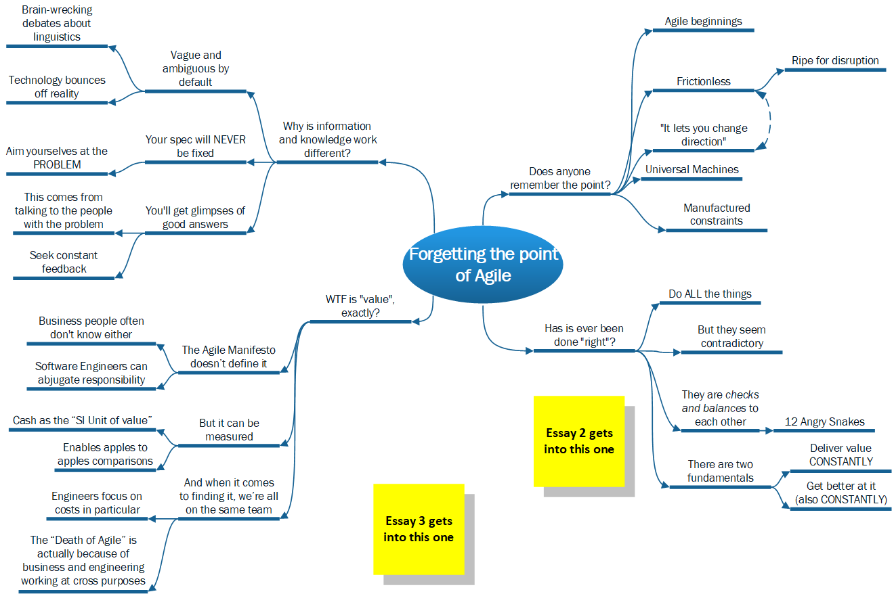

# We have forgotten the point of Agile

This is the Mind Map of the "forgotten the point" article.

## TLDR of the whole series

1. **Have we forgotten the point of "Agile"?** Yes! First and foremost, it was a defensive way of delivering work in a frictionless, unconstrained un-reality of infinite possibilities. Once we remember this, it all makes a lot more sense.
2. **"[Agile" Anti-Patterns](./Agile_AntiPatterns.md):** when software engineers, product people and designers all work at loggerheads to each other, it all goes belly up. And even more so when the ways we strategise *aren't* agile.
3. **[Valuable agility](./Agile_Value.md):** conversely, when software, product and design collaborate beautifully, it's possible to navigate the "Digital Realm*" not only safely, but in ways that put you way ahead of the competition.

\* It's like the Quantum Realm from Ant-Man but with *a lot more meetings*.

## Whose bandwagon am I shamelessly jumping onto?

Why - Dave Thomas's of course... He famously\* declared "[Agile is dead](https://youtu.be/a-BOSpxYJ9M?si=m5g_B7sa9_wK06cp)" in 2015, and that opened the door for a great many others to jump through. A large cohort of these folks seem to be computer programmers who don't like meetings (more in the next one), but it also struck a chord with Dave's fellow dignitaries of the agilista community.

Dave's most elegant point concerns the difference between:

* **"Small-a-agility":** where agile remains an adjective, i.e. something describing behaviour.
* **"Capital-A-Agile":** which is a noun, i.e. something you can package up into a certified training course and sell to people.

I like this concept so I'm going to steal it for these articles. I'm also going to refer to the [update he's started giving](https://youtu.be/bEMg9XXIcew?si=WMmJucZFqZma3xt0) to the original talk, too.

\* Well, for a computer programmer - Dave's not Taylor Swift, exactly. Indeed he's probably not even Sue Pollard. But his talk has had 1.4 million views.

## Does *anyone* remember the point?

The OG agilistas Allen Holub and Dave Farley\* [nearly do](https://youtu.be/hxXmTnb3mFU?t=665) - Dave talks about "opening up infinite possibilities" as opposed to being "fundamentally constrained" by big-design-up-front. But small-a-agility doesn't *open infinite possibilities up*, and "waterfall approaches" can't and don't ever *actually* constrain you. Working in the Digital Realm *causes* these endless, frictionless possibilities, which no amount of up-front-design can cope with. Designs and concepts in the Digital Realm refuse to remain fixed. Even the most detailed of design drawings will get diddled with as soon as you try and implement it, and even assuming you get close, it won't be long before you've tweaked the implementation out of step with the design; purely *because you can*, and you'll interpret it differently to the intention.

Small-a-agility was originally conceived as a *defence mechanism to cope with all this*. This is what we have lost sight of.

\* I'll probably refer to Dave Farley a lot in these articles. Just in case you don't know, Dave co-wrote [Continuous Delivery](https://martinfowler.com/books/continuousDelivery.html); a strong candidate for being the Bible of small-a-agile software engineering.

### Agile beginnings

(Refer to James Shore here)...

### "It lets you change direction" misses the point

It's not capital-A-Agile that's "letting you change direction". Working in the Digital Realm *means you are going to change direction* whether you like it or not. There's literally nothing stopping you. I've been in situations during my engineering career where the thing I thought I was working on would change three or four times in a day. I would go into work clear in my head about what I would be working on, and my precious sense of certainty would be nothing but a glorious memory by 9:30am.

Small-a-agility is the only thing that gives us a cat-in-hell's chance of managing our adventures in the Digital Realm. So to paraphrase Churchill: "it's the worse form of planning and management, apart from all the others".

### Univeral Machines and infinite spaces

I've been extremely lucky to be coached by two different software engineers\* who really got small-a-agility. One of them told me a story about helping his dad, a Quantity Surveyor in the Real World, select some software to use. After he'd helped pick the best system for his dad to buy, he told him how lucky he was to know, up front, how big a space there would be to build in, and to have the laws of physics constrain everything.

We don't have these luxuries in the Digital Realm - if your client decides that they would like a submarine dock in the basement of the hospital you've spent the last three years building them, and a space-port on the roof, and that they'd like you to put the ceilings in before you've built the walls, then there's no practical reason why you can't. We work with "Universal Turing Machines" in a slippery, frictionless world of (very nearly) pure information and imagination: there are zero physical constraints.

"You're driving me nuts" doesn't cut it as a defence against this, either - they'll just find someone else to burn out instead of you, at least until their money runs out. "You're the boss" and "I was only following orders" can help a certain caste of programmer on the sanity front, but will only ever result in something good by the flukiest of accidents.

\* More Dave Farley here, on [the difference between Programmers, Developers and Engineers](https://www.youtube.com/watch?v=fcjBfSiyI0k&t=2s).

### Lack of friction

So the infinity and lack of friction results in constant uncertainty about what we do. It also means that everything we *do* achieve is much more vulnerable to disruption than Real World endeavours. The Digital Realm has an extremely low barrier to entry - case in point: how two broke students [completely turned the world of travel accommodation upside down](https://knowledge.wharton.upenn.edu/podcast/knowledge-at-wharton-podcast/the-inside-story-behind-the-unlikely-rise-of-airbnb/).

If our laurels are in the Digital Realm then we can never rest on them. Even if we are hugely successful, we have to be able to re-invent everything over and over again. Take Microsoft Office as an example of that - it's been rebuilt from the ground up four or five times over the years - the only constant is the brand. The same old boss of mine used to describe this as "re-building the engine of a sports car while it's doing 170 mph in the fast lane".

This is *nearly* impossible - with small-a-agility tipping the balance from "completely" to "nearly".

### Manufactured constraints

The defence against frictionless uncertainty is to *manufacture constraints* to work within. The ones that can be made to work are *time* and *money*.

Uncertainty is a constant, so if we work in teeny-tiny increments of time, and check where we are at the end of every increment, we're at least only ever uncertain about a few things at a time, for a short while. Dave Thomas nails this in his follow-up talk.Money (or should I say *value*?) gives us a direction to travel in. Even tiny-little baby steps waste time and effort if you take them in the wrong direction. 

**Massive spoiler alert:** the second of these is **much harder to get right** than the first, because it requires business people that understand design and engineering, and engineers and designers who get business. Gulp!

## Why information and knowledge work is so different

### Vagueness and ambiguity

Brain-wrecking semantic / linguistic debates about abstract concepts.

Digital technology bounces off reality and it'll *never" be a perfect fit. (See Douglas Hofstadter for details. And probably Roger Penrose while you're at it...)

### Your spec with *never* be fixed

... so instead, aim yourselves at problems that you might be able to fix.

### The best you can hope for - glimpses of good answers

Talk to the people with the problem, constantly.

Get their feedback about where your solution to the problem is going

## Has Agile *ever* been "done right"?

### You have to do **ALL** the things

### But they *seem* contradictory?

### In fact they are checks and balances to each other

The Twelve Angry Snakes

### There are two fundamentals

Deliver value *constantly*.

Get better at doing it (also *constantly")

## WTF is "value" exactly?

Brace yourselves as I'm probably going to bang on about my PhD in this bit...

### Bad news - value is subjective

### Good news - it *can* be measured (at least roughly)

Increased profit, reduced costs, reduced risks.
