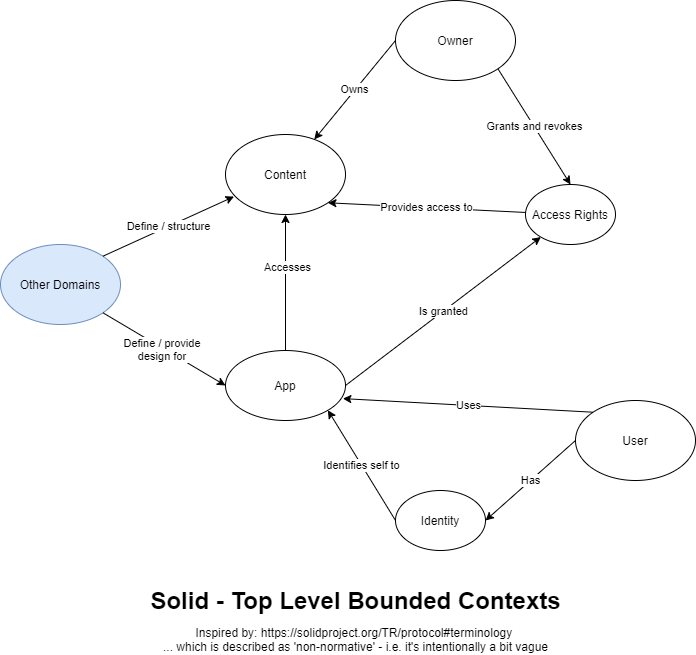

# Getting Started With Solid

My PhD research had quite a lot to do with Social Media. I started it in 2012 while people were still feeling quite optimistic about that, but there's been a whole heap of Brexit, Donald Trump and so forth since then. Indeed it was quite obvious there was going to be a bumpy road ahead while I was researching Social Media (OK, hindsight and all that), so my refers to [Zeynep Tufekci](https://zeynep.me/), [danah boyd](https://www.danah.org/), [Geert Lovink](https://networkcultures.org/geert/biography/) and a few other healthy naysayers. I stopped using Facebook shortly after I published [my thesis](https://repository.lboro.ac.uk/articles/thesis/Does_the_way_museum_staff_define_inspiration_help_them_work_with_information_from_visitors_Social_Media_/9496598), and while I still have a Twitter account and take the odd stroll around it now and again, I don't really use it.

However, it wasn't all doom and gloom: one the things I learned was that it's not Social Media per-se that's at fault for the way things have gone, it's *the business models of the industrial Social Media companies* that are the problem. Of course, those companies don't really have 'business models' in the traditional, fuddy-duddy sense of: "doing something valuable that people want to pay for"; they run on a "get plenty of eyeballs using your platform and try to convince investors you'll be able to monetise that one day" model... As such, their focus is mainly on the former part of that equation - people have to pretty much get addicted to these big platforms, and "stick" to them or the fountain of Investment Capital runs dry, as this [marvellous Guardian long-read by Richard Seymour](https://www.theguardian.com/technology/2019/aug/23/social-media-addiction-gambling) explains. 

A crucial piece of the addiction puzzle is that nothing's going to guarantee "engagement" better than a good, old fashioned screaming match. Genteel agreement, on the whole, results in one "yes you're right" type post per participant, but if we all want to have the last word, well... 

So in a world where every post of Donald Trump's initiated a million "no you're the asshole, no you're the asshole" backs-and-forths, Twitter and Facebook could add to their "engagement" stats and put some "good" numbers in front of investors. Hence Trump being allowed to go all the way up to encouraging people to attack the Capitol Building before they switched him off. This situation of arguments and dissent producing "high engagement" is not what anyone sane would call healthy, is it? It's also a prime example of a very current phenomenon, namely: "good numbers masking bad juju" (as Hunter S. Thompson probably wouldn't have said).

My research, therefore, concurred with many others... For Social Media to actually deliver upon early promises of "the wisdom of crowds" and "bottom-up democratic structures", it needs to be decentralised from big, industrial players. Just the concept of making an industry out of people's friendships seems wrong, doesn't it? 

Anyway, it turns out that no less a luminary than Sir Tim Berners-Lee appears to agree with this, as described here, in [another Guardian article by John Harris](https://www.theguardian.com/lifeandstyle/2021/mar/15/tim-berners-lee-we-need-social-networks-where-bad-things-happen-less). So Sir Tim has put his weight behind a technological specification for an approach called [Solid](https://solidproject.org/). The idea behind this is that people will start storing their own personal data and content in "Personal Online Data Stores", or Pods. Access to these Pods is controlled using open authentication and authorisation protocols (i.e. the [Solid implementation of Open Id Connect](https://solid.github.io/solid-oidc/)), and the Pod owner gets to grant and revoke access to specific bits of data / content / "stuff" in their Pod to different "agents", which would most likely be applications used by specifically-identified individuals or organisations.

Those who have been working in the web area for a long time will know that there's nothing Sir Tim seems to like more than a meaty old specification, and true to form, Solid has about a dozen or so of those to cover it's various moving parts, with [this one](https://solidproject.org/TR/protocol) being the mother. I, on the other hand, like a good picture, so as I'm intrigued by all this, I've done a first-pass diagram based on a very quick-and-dirty skimming of it all (mainly just reading intro stuff and the basic terminology parts so far). 

You may also notice a bit of the terminology of [Domain-Driven Design](https://en.wikipedia.org/wiki/Domain-driven_design) (DDD) creeping into my picture (i.e. "Bounded Contexts"). This is something I'm still a bit new to but hopefully the DDD jargon doesn't really affect the info in the diagram too much. It also (intentionally) doesn't match the exact terminology of the intro to Solid, because I've tried to dial down the technical jargon at least a bit (so no URIs, Agents, Root Containers, Read and Write Operations etc etc yet - they'll come along soon enough). 

Another thing that DDD tells us is that such first pass attempts at understanding are inevitably wrong, so this picture will certainly change as I learn more. However, even at this early stage, one thing I believe could be so significant that I've coloured it blue is my feeling that Solid is kind of abstract: there's a lot of "how" one would keep one's "stuff" under control, but it's going to be easier to make sense of that, in future, by applying a bit of "why", in the contexts of "Other Domains". 

Eric Evans' [original book about DDD](https://www.abebooks.co.uk/book-search/isbn/0321125215/?cm_mmc=ggl-_-UK_ETA_DSA-_-naa-_-naa&gclid=Cj0KCQiA15yNBhDTARIsAGnwe0Un_0rHUV-jIFMqSB1SUQ4gcyDnN3AoWXnfyR9IrsRbGdQ5hJp32NkaAjEnEALw_wcB) (so significant that he coloured it blue, too) is 20 years old, now, so it discusses the Domain Model's place in a 'layered architecture' in a way that seems a little dated nowadays. However, a core DDD concept is that "the Domain" is intended to be a "representation of business information", which ought to be isolated from "Presentation", "Application" and "Infrastructure" layers. Even if the "layered" way of thinking about this seems a bit clunky these days, this need to isolate "a representation of business" from the other moving parts still definitely holds true if you want to be able to make quick and timely changes to your software as new opportunities come to light.

Solid, then, looks to me like it's actually got its fingers more in the Application and Infrastructure parts of the pie, so the trick is probably going to be how to adapt it for each Domain we want to apply it to. It's highly likely that the People (i.e. Owners and Users) will have significantly different needs from Domain to Domain, too. So another question is probably:  "...how might we come up with processes to adapt Solid accordingly?" But I'm going to have to dive a lot more deeply into it before I can try to answer that.

Off the top of my head, though, I can think of two Domains with potential problems that Solid might help address...

## Academic research and knowledge management: 

I think there are probably some killer apps that Solid could be part of in this Domain, which would be fitting as it's the one that Sir Tim founded the WWW from in the first place, of course. Just off the top of my head I can think of two thorny academic problems that Solid could help with... 

Firstly, it's just tricky to keep track of who was doing what research, where, and with whom. Academics need to be able to carry their achievements around with them, while institutions also need to be able to account for which work was done under their auspices, and all of that gets even harder when research teams span institutions, and lines of inquiry can take years to pursue. I found out enough about this while sitting on the University of Cambridge's Research Data Management Working Group to make one's hair curl. 

Then the second problem relates to what happens to important knowledge when prominent Academics die: the Archivists at Cambridge University Library were still very much thinking in terms of "boxes of files of papers" that they would be able to ingest and sift through under such sad circumstances, but those days have by-and-large gone. 

Fortunately the core of Solid is to formally mark individual owners with a global identity that can live as long as they do, and then it appears to be perfectly OK for:

1. Owners to own multiple pods.
2. Ownership to be passed onto others.

Just these two things would contribute greatly to helping solve both the issues above. An individual academic could build up a trail of Pods as they moved from one place to another, and access could be maintained at both an individual and institutional level. Though good models of how research is conducted to provide the Domain structure would be a big help... (Perhaps more on that in future?)

## Software / IT recruitment:

Anyone who has been in the Software Development game for any amount of time will tell you just how irritating the recruitment process is. Indeed it quite often strays way beyond irritating and into the realms of moral reprehensibility. It's bad enough when you're looking for a job, but if, like me, you've been involved in hiring people, it gets even worse. We're talking about a 360 degree shower of untruths, perpetrated by a gang of miscreants and cutthroats that make The Pirates of the Caribbean look like the Teddy Bear's Picnic. 

I may be exaggerating slightly for comic effect here (and it's a while since I've dared dive into the process), but fundamentally, technology such as email and the internet has distorted the process of recruiting technical staff to the point that the best way to succeed seems to be to just fling as much "stuff" at the wall as quickly as possible, so at least some of it sticks. This is made possible because the "content" used (candidate CVs on one side, company roles on the other) have to be "broadcast" in some way - they have to be "put out there". 

This means that there's always plenty of "stuff" to throw, and plenty of walls to throw it at, and hence all you really need to be able to do to succeed is collect and throw quickly. Understanding the problems that companies have, and lining up appropriate candidates, are neither here nor there. Learning about the roles they're recruiting for, or the skills candidates have, doesn't give anyone a competitive advantage over the "stuff throwers...

... at least, actually being good at recruitment doesn't give anyone a competitive advantage *while all the CVs and job descriptions remain in the public domain*. But imagine a world in which:

1. Candidates kept their CVs in Pods, to which they only granted access to recruiters they trusted would do a good job.
2. Companies kept their role descriptions in Pods, to which they only granted access to recruiters they trusted would do a good job. 

In *that* world, there's a massive competitive advantage to being a good recruiter, and the days of "stuff flinging" might potentially be numbered? 
